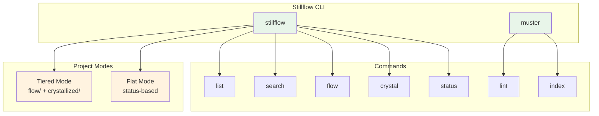
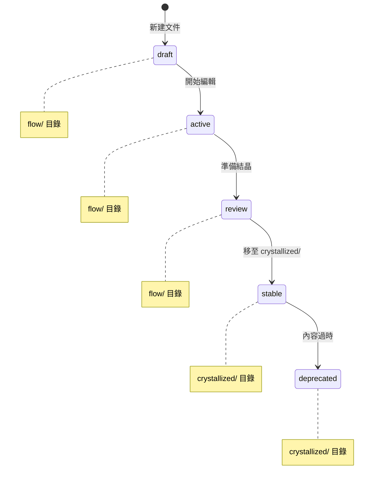
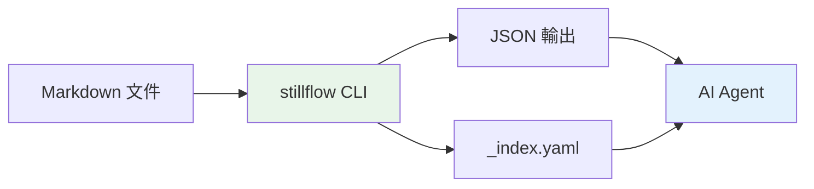

# Stillflow - ContextOps 工具概覽

---

## 📋 文檔目的

本文檔提供 **Stillflow** 系統的概覽，幫助讀者理解：
- Stillflow 在 LuminNexus 生態系中的定位
- CLI 指令的功能與使用方式
- 文檔生命週期管理的工作流程

> **詳細操作手冊**: 請參考 [Stillflow Runbook](https://github.com/anthropics/LuminNexus-Stillflow/blob/main/projects/Stillflow/crystallized/runbook.md)
>
> **本地路徑**: `LuminNexus-Stillflow/projects/Stillflow/crystallized/runbook.md`

---

## 🎯 系統概述

**Stillflow** 是 LuminNexus 的 **ContextOps CLI 工具**，負責：
- 文檔生命週期管理 (flow → crystallized)
- Frontmatter 驗證與索引生成
- 跨專案文檔搜尋與狀態追蹤

### 核心理念

ContextOps = Context + Operations

將技術文檔視為有生命週期的資產，從草稿 (draft) 到穩定 (stable)，提供工具支援整個流程。

---

## 🏗️ 系統架構



### 文檔生命週期



---

## 📦 指令列表

### stillflow 指令

| 指令 | 功能 | 範例 |
|------|------|------|
| `list` | 列出所有文件 | `stillflow list --project Rust` |
| `search` | 搜尋文件 | `stillflow search "author:maple"` |
| `flow` | 查看 flow 狀態文件 | `stillflow flow --today` |
| `crystal` | 查看 crystallized 文件 | `stillflow crystal` |
| `status` | 統計狀態總覽 | `stillflow status --json` |

### muster 指令

| 指令 | 功能 | 範例 |
|------|------|------|
| `lint` | 驗證 frontmatter | `muster lint projects/` |
| `index` | 生成 _index.yaml | `muster index projects/Rust/` |

---

## 🔄 專案模式

Stillflow 支援兩種專案模式：

| 模式 | 說明 | 適用場景 |
|------|------|----------|
| **tiered** | 使用 `flow/` + `crystallized/` 目錄結構 | 有生命週期的專案 |
| **flat** | 任意目錄結構，依據 status 分類 | 純文檔庫（如 LearningMap） |

### Mode 偵測優先級

```
1. CLI flag (--mode flat)     # 最高優先
2. .stillflow.yaml config     # 專案配置
3. Auto-detect                # 自動偵測
```

---

## 🔄 與其他系統的關係

### 整合專案

| 專案 | 模式 | 說明 |
|------|------|------|
| LearningMap | flat | 文檔庫，依 status 分類 |
| LuminNexus-Stillflow | tiered | 使用 flow/crystallized 結構 |
| 各專案 repo | tiered | 標準文檔管理 |

### 資料流



---

## 🔑 關鍵概念

### Frontmatter Schema

每個文檔必須包含：

```yaml
---
title: 文件標題
type: note           # note, summary, reference, spec, guide, runbook
status: draft        # draft, active, review, stable, deprecated
created: 2025-12-18
author: your_name
tags:
  - topic
---
```

### Search Query Syntax

```
<field>:<value> [<field>:<value> ...]
```

支援欄位：`project`, `type`, `status`, `author`, `tags`, `folder`

---

## 📚 相關文檔

### 內部文檔
- [00_architecture-overview.md](../00_architecture-overview.md) - 整體架構
- [DOCUMENTATION_POLICY.md](../DOCUMENTATION_POLICY.md) - 文檔撰寫規範

### 外部專案文檔
- `LuminNexus-Stillflow/projects/Stillflow/crystallized/runbook.md` - **Runbook 操作手冊**
- `LuminNexus-Stillflow/README.md` - Stillflow README

---

## ❓ 常見問題

### Q1: Stillflow 和一般的文檔管理工具有什麼差別？
**A**: Stillflow 專注於「生命週期」管理，將文檔從草稿到穩定的過程標準化，並提供 CLI 工具支援 AI Agent 整合。

### Q2: 什麼時候該用 tiered mode vs flat mode？
**A**:
- **tiered**: 專案有明確的 draft → stable 流程
- **flat**: 純文檔庫，文檔相對獨立

### Q3: 如何讓 AI Agent 使用 Stillflow？
**A**: 使用 `--json` 輸出或讀取 `_index.yaml` 索引檔案。

---

## 📝 文檔維護

### 版本歷史

| 版本 | 日期 | 作者 | 變更說明 |
|------|------|------|----------|
| 1.0 | 2025-12-18 | maple | 初版建立 |

### 維護職責
- **主要維護者**: Stillflow Team
- **審核者**: Architecture Team
- **更新頻率**: 每季度檢視一次

---

**文檔結束**
