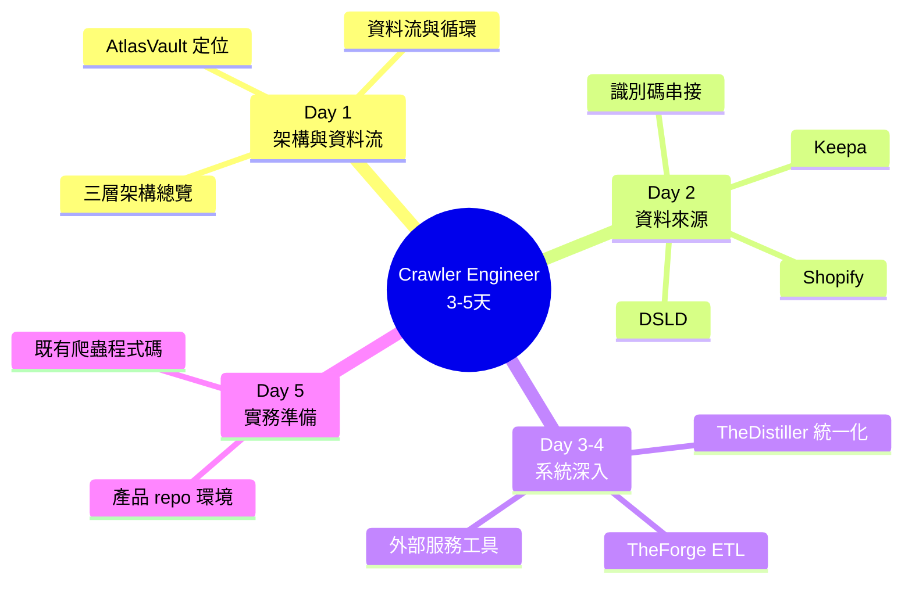

# Crawler Engineer Learning Map - 爬蟲工程師學習大綱

---

## 設計原則

- **快速上手**: 3-5 天理解資料蒐集全貌與既有系統
- **導覽為主**: 教材已存在於 data-sources/ 與 projects/，本大綱負責串接順序
- **實務導向**: 聚焦實際維護的爬蟲與資料管線

---

## 角色概述

**職責**: 資料蒐集、爬蟲開發與維護、資料清洗與入庫

**工作範圍**（對應 LuminNexus Layer 1: AtlasVault）:
- 維護 DSLD / iHerb / Keepa 等來源的爬蟲
- 理解各資料來源的欄位結構與識別碼串接
- 資料進入 Vault 後的 ETL 流程（TheForge → TheDistiller）

---

## 🗺️ 學習路徑

---

## 📋 學習路徑詳細

### Day 1: 架構與資料流（必修）

1. [projects/00_architecture-overview.md](../projects/00_architecture-overview.md) - 三層架構總覽
2. [projects/01_data-flow.md](../projects/01_data-flow.md) - 資料流與系統串連 ⭐
3. [projects/atlasvault/00_overview.md](../projects/atlasvault/00_overview.md) - AtlasVault（你的主場）

### Day 2: 資料來源知識（必修）

1. [data-sources/data-sources-guide.md](../data-sources/data-sources-guide.md) - 識別碼（UPC/ASIN/brandCode）與跨平台串接 ⭐
2. [data-sources/dsld/dsld_database_guide.md](../data-sources/dsld/dsld_database_guide.md) - DSLD 資料庫指南
3. [data-sources/keepa/amazon_concepts_guide.md](../data-sources/keepa/amazon_concepts_guide.md) - Amazon/Keepa 概念
4. [data-sources/shopify/shopify_crawler_guide.md](../data-sources/shopify/shopify_crawler_guide.md) - Shopify 爬蟲指南

**深度參考**（隨查隨用，不需通讀）:
- [data-sources/dsld/json_structure_reference.md](../data-sources/dsld/json_structure_reference.md)
- [data-sources/keepa/product_object_reference.md](../data-sources/keepa/product_object_reference.md)
- [data-sources/keepa/seller_object_reference.md](../data-sources/keepa/seller_object_reference.md)
- [data-sources/keepa/keepa_api_query_methods.md](../data-sources/keepa/keepa_api_query_methods.md) - 含 Token/速率控制
- [data-sources/shopify/shopify_response_reference.md](../data-sources/shopify/shopify_response_reference.md)

### Day 3-4: 系統深入（必修）

1. [projects/atlasvault/vault.md](../projects/atlasvault/vault.md) - 中央資料庫 (Single Source of Truth)
2. [projects/atlasvault/theforge.md](../projects/atlasvault/theforge.md) - ETL 層（Pure ETL + Unified Forge）⭐
3. [projects/alchemymind/thedistiller.md](../projects/alchemymind/thedistiller.md) - 資料統一化與 Identity Resolution
4. [tools/external-services.md](../tools/external-services.md) - Keepa / Oxylabs / Jina AI 等外部服務
5. [tools/google-product-category-intro.md](../tools/google-product-category-intro.md) - 商品分類標準

### Day 5: 實務準備

- 取得產品 repo 存取權限（LuminNexus-AtlasVault-* 系列專案）
- 閱讀對應爬蟲的 README 與 CLAUDE.md
- 跟隨資深同事跑一次完整的爬取 → 入庫 → ETL 流程

> **📌 註**：projects/atlasvault/ 的 dsld-crawler.md、iherb-crawler.md、dsldxkeepa.md
> 目前為 skeleton（待各團隊補充），爬蟲實作細節請以產品 repo 文檔為準。

---

## 前置知識

先完成 [general/00_outline.md](../general/00_outline.md) 基礎階段，特別是：
- [general/02_unix-linux-basics.md](../general/02_unix-linux-basics.md) - 命令列操作
- [general/03_data-engineering.md](../general/03_data-engineering.md) - JSON、資料庫、ETL 概念 ⭐

---

## 能力驗證標準

### 基礎能力（Day 1-5 完成後）
- ✅ 能說明三層架構與資料流方向
- ✅ 能說明 UPC / ASIN / brandCode 的用途與串接方式
- ✅ 理解 DSLD / Keepa / Shopify 三種來源的資料結構差異
- ✅ 理解 TheForge 與 TheDistiller 在管線中的分工

### 進階能力（後續累積）
- 🔄 能獨立維護一條爬蟲管線
- 🔄 能處理反爬與代理服務設定
- 🔄 能設計新資料來源的欄位對應

---

## 常見問題

### Q: 教材為什麼散在好幾個目錄？
A: data-sources/ 放「外部資料源知識」，projects/atlasvault/ 放「我方系統設計」，tools/ 放「外部服務工具」。本大綱就是把它們串成學習順序的導覽。

### Q: 爬蟲程式碼在哪裡？
A: 不在本 repo。本 repo 只有文檔；程式碼在 LuminNexus-AtlasVault-* 產品 repo，需另行取得權限。

---

**版本歷史**

| 版本 | 日期 | 變更內容 | 作者 |
|------|------|---------|------|
| 1.0 | 2026-07-04 | 初版建立，串接既有 data-sources / atlasvault / tools 教材 | maple |
