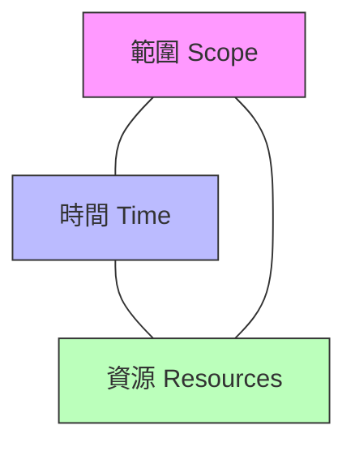

# Project Manager Learning Path - 專案管理學習路徑

**版本**: 1.0
**更新日期**: 2025-11-10
**適用角色**: Project Manager, Product Manager, Team Lead
**前置要求**: 完成 General Learning Map 基礎階段 (01-05)

---

## 設計原則

- **實用導向**: 聚焦實際工作中常用的概念與術語
- **快速理解**: 提供清晰的定義與情境範例
- **跨角色共通**: 適合 PM, PO, Team Lead, 以及需要理解專案管理概念的技術人員
- **非教科書式**: 避免過度理論，專注於實務應用

---

## 角色概述

### Project Manager 在團隊中的角色
- **協調溝通**: 連接業務、設計、開發、測試等各個角色
- **進度管理**: 確保專案按時交付，平衡範圍、時間、資源
- **風險管理**: 識別並處理專案風險，避免問題擴大
- **品質把關**: 確保交付成果符合預期標準

---

## 核心概念

### 1. 專案管理關鍵術語

#### 1.1 Technical Debt (技術債)

**定義**:
為了快速交付功能，選擇「當下簡單但未來會增加維護成本」的實作方式，所累積的額外工作量。

**為什麼會產生技術債？**
- ⏰ **時間壓力**: 需要快速上線，選擇捷徑
- 🎯 **需求不明確**: 先做再說，之後再優化
- 🔄 **技術演進**: 舊的實作方式已過時
- 📚 **知識不足**: 當時不知道更好的做法

**技術債的類型**:
- **Code Debt (程式碼債)**: 難以維護的程式碼、缺少測試
- **Architecture Debt (架構債)**: 系統架構不合理，擴展困難
- **Documentation Debt (文檔債)**: 缺少文檔或文檔過時
- **Testing Debt (測試債)**: 測試覆蓋率不足

**實際案例**:
```
情境: 電商網站需要在雙11前上線促銷功能

技術債決策:
- 快速方案: 直接在現有程式碼中硬編碼折扣邏輯 (3天)
- 正確方案: 設計彈性的促銷規則引擎 (2週)

選擇快速方案 → 累積技術債

後果:
- 下次促銷需要再次修改程式碼
- 每次修改都可能引入 bug
- 維護成本持續增加
```

**如何管理技術債？**
- 📊 **記錄追蹤**: 建立技術債清單，定期 review
- ⚖️ **優先級排序**: 評估影響範圍與修復成本
- 🗓️ **定期償還**: 在 sprint 中預留時間處理技術債
- 💬 **透明溝通**: 讓所有人理解技術債的影響

**PM 需要知道的**:
- ⚠️ 技術債不是「bug」，而是「設計選擇」
- 📈 技術債會隨時間累積，影響開發速度
- 💰 適度的技術債可以接受，但要有償還計畫
- 🚫 不要一味要求「完美」，要平衡速度與品質

---

#### 1.2 Legacy Code (遺留代碼 / 舊程式碼)

**定義**:
沒有測試、難以理解、難以修改的舊程式碼。通常是前人留下的，缺少文檔，但系統仍在使用。

**Legacy Code 的特徵**:
- ❌ **缺少測試**: 不敢修改，怕弄壞系統
- 📜 **沒有文檔**: 不知道為什麼這樣寫
- 🧩 **複雜糾結**: 邏輯混亂，難以理解
- 👴 **技術過時**: 使用已淘汰的技術或寫法
- 😱 **原作者離職**: 沒人敢動這段程式碼

**為什麼 Legacy Code 是問題？**
- 🐢 **減慢開發速度**: 修改需要花大量時間理解
- 🐛 **容易引入 Bug**: 不理解的程式碼容易改壞
- 😰 **團隊壓力**: 開發人員害怕接觸這些程式碼
- 💸 **維護成本高**: 每次修改都是冒險

**實際案例**:
```
情境: 需要修改 5 年前的訂單處理系統

Legacy Code 問題:
- 2000+ 行的單一函數
- 變數名稱: a, b, tmp, result
- 沒有註解說明
- 沒有任何測試
- 原作者已離職 3 年

結果:
- 簡單的需求變更估時從 2 天變成 2 週
- 開發人員需要逐行閱讀理解邏輯
- 修改後不敢確定是否正確
```

**如何處理 Legacy Code？**
- ✅ **先寫測試**: 用測試固定現有行為
- 📝 **逐步重構**: 小步改進，不要大規模重寫
- 📚 **補充文檔**: 理解一部分就記錄一部分
- 🛡️ **風險控制**: 重要系統謹慎處理
- 🎓 **知識傳承**: 團隊內部分享理解

**PM 需要知道的**:
- ⏰ Legacy Code 的修改時間通常比預期長
- 🚫 不要輕易說「重寫」，風險極高
- 📊 需要在「功能開發」和「程式碼改善」之間平衡
- 💡 理解「慢就是快」的道理

---

#### 1.3 Scope Creep (範圍蔓延)

**定義**:
專案範圍在執行過程中不斷擴大，超出原始規劃，但時間和資源沒有相應增加的現象。

**Scope Creep 如何發生？**
- 💬 **需求變更**: 「順便加個小功能」
- 🎨 **完美主義**: 「既然都做了，不如做好一點」
- 👤 **Stakeholder 要求**: 「這個功能很重要，一定要加」
- 🔍 **發現新需求**: 開發過程中發現遺漏的需求
- 🚫 **缺少變更管理**: 沒有正式的變更流程

**典型對話 (Scope Creep 警訊)**:
```
❌ "既然都做登入了，順便加個第三方登入吧？"
❌ "這個按鈕能不能換個顏色？還有順便加個動畫？"
❌ "我們要不要順便把後台管理介面也優化一下？"
❌ "客戶說這個功能很重要，我們加上去吧"
```

**Scope Creep 的影響**:
- ⏰ **延遲交付**: 原定 2 週的專案變成 2 個月
- 😫 **團隊疲勞**: 永遠做不完，士氣低落
- 💰 **預算超支**: 時間拖長，成本增加
- ⚠️ **品質下降**: 趕工導致測試不足
- 🎯 **失去重點**: 核心功能被稀釋

**實際案例**:
```
專案: 電商網站商品搜尋功能

原始範圍:
- 基本關鍵字搜尋
- 價格排序
- 預計 2 週完成

Scope Creep 過程:
Week 1: "能不能加上品牌篩選？"
Week 2: "要不要支援拼音搜尋？"
Week 3: "這個搜尋結果能不能更智能？"
Week 4: "能不能記錄用戶搜尋歷史？"
Week 5: "能不能做搜尋推薦？"

結果:
- 原定 2 週 → 實際 6 週
- 團隊疲憊，品質下降
- 核心功能被延遲
```

**如何防止 Scope Creep？**

1. **明確定義範圍**
   - ✅ 清楚的需求文檔
   - ✅ 定義「In Scope」和「Out of Scope」
   - ✅ 驗收標準明確

2. **建立變更流程**
   - 📋 變更請求表單
   - 🔍 評估影響 (時間、成本、資源)
   - ✅ 正式批准流程

3. **學會說「不」或「延後」**
   - ❌ "這個需求很好，但不在本次範圍內"
   - 📝 "我們記錄下來，放到下一期規劃"
   - ⚖️ "如果要加這個功能，需要延後 1 週，你同意嗎？"

4. **定期溝通**
   - 📊 定期 review 專案範圍
   - 💬 與 stakeholder 保持透明溝通
   - 🎯 強調核心目標

**PM 需要知道的**:
- 🛡️ 守護專案範圍是 PM 的核心職責
- ⚖️ 每個「小需求」都會累積成大問題
- 💬 學會有技巧地拒絕不合理的需求
- 📝 所有變更都應該經過正式評估

---

### 2. 敏捷開發核心術語

#### 2.1 Sprint (衝刺)

**定義**:
固定時間長度的開發週期，通常為 1-4 週，團隊在此期間專注完成預定的工作項目。

**Sprint 的結構**:
```
Sprint 週期 (2週範例):

Day 1: Sprint Planning (規劃會議)
→ 決定這個 sprint 要做什麼

Day 2-9: Daily Standup (每日站會)
→ 同步進度、發現問題

Day 10: Sprint Review (成果展示)
→ 展示完成的功能

Day 10: Sprint Retrospective (回顧會議)
→ 討論改進方向
```

**Sprint 的好處**:
- 🎯 **聚焦**: 固定週期內專注於優先事項
- 📊 **可預測**: 定期交付，容易估算進度
- 🔄 **快速迭代**: 頻繁發布，快速獲得反饋
- 🛡️ **防止 Scope Creep**: Sprint 中不接受新需求

**PM 實務建議**:
- ⏰ Sprint 長度固定，不要隨意調整
- 🚫 Sprint 進行中避免變更需求
- 📊 追蹤 Sprint 完成率，持續改進

---

#### 2.2 Backlog (待辦清單)

**定義**:
按優先級排序的所有待完成工作項目清單。

**Backlog 的層級**:

1. **Product Backlog (產品待辦清單)**
   - 所有想做的功能與改進
   - 由 Product Owner 維護
   - 持續更新優先級

2. **Sprint Backlog (衝刺待辦清單)**
   - 本次 Sprint 要完成的項目
   - 從 Product Backlog 中挑選
   - Sprint 期間相對固定

**良好 Backlog 的特徵 (DEEP)**:
- **D**etailed appropriately: 近期項目細節多，遠期項目粗略
- **E**stimated: 有工作量估算
- **E**mergent: 持續演進更新
- **P**rioritized: 有明確優先級

**PM 實務建議**:
- 📊 定期 Backlog Refinement (整理會議)
- 🎯 前 3 個 Sprint 的項目要詳細定義
- 🔄 根據反饋調整優先級

---

#### 2.3 Velocity (速度 / 速率)

**定義**:
團隊在一個 Sprint 中能完成的工作量，用來預測未來的交付能力。

**如何計算 Velocity？**
```
範例 (使用 Story Points 估算):

Sprint 1: 完成 20 points
Sprint 2: 完成 25 points
Sprint 3: 完成 22 points

平均 Velocity = (20 + 25 + 22) / 3 = 22 points

預測: 未來每個 Sprint 可完成約 22 points 的工作
```

**Velocity 的用途**:
- 📊 **預測交付時間**: "這個功能大約需要 3 個 Sprint"
- 📈 **團隊能力指標**: 追蹤團隊效率變化
- ⚖️ **容量規劃**: 決定下個 Sprint 承接多少工作

**常見誤區**:
- ❌ **誤區 1**: 把 Velocity 當作 KPI 考核團隊
  - ✅ Velocity 是「預測工具」，不是「績效指標」
- ❌ **誤區 2**: 跨團隊比較 Velocity
  - ✅ 每個團隊的估算標準不同，不能直接比較
- ❌ **誤區 3**: 強迫提升 Velocity
  - ✅ 應該關注「交付價值」而非「數字」

**影響 Velocity 的因素**:
- 👥 團隊成員變動
- 📚 技術債的累積
- 🐛 生產環境問題處理
- 🎓 新技術學習
- 🛠️ 工具與流程改進

**PM 實務建議**:
- 📊 至少 3 個 Sprint 後再計算平均 Velocity
- 🔍 Velocity 下降時要找出原因
- 💬 透明溝通，避免數字遊戲

---

## 專案管理實務

### 3.1 平衡鐵三角

專案管理的核心挑戰是平衡三個因素:



**核心概念**:
- 📊 改變任何一個因素，其他因素必須調整
- ⚖️ 不能同時要求「功能多、時間短、資源少」

**實際情境**:
```
情境 1: 時間固定
需求增加 → 必須增加資源 或 砍掉部分功能

情境 2: 資源固定
需求增加 → 必須延長時間 或 砍掉部分功能

情境 3: 功能固定
資源減少 → 必須延長時間 或 降低品質標準
```

---

### 3.2 風險管理基礎

**常見專案風險**:
- 👥 **人員風險**: 核心成員離職、請假
- 📋 **需求風險**: 需求不明確、頻繁變更
- 🛠️ **技術風險**: 技術選型錯誤、技術債累積
- 🏢 **外部依賴**: 第三方服務不穩定
- ⏰ **時程風險**: 低估工作量、過度承諾

**風險管理流程**:
1. **識別**: 列出可能的風險
2. **評估**: 評估發生機率與影響程度
3. **應對**: 制定應對策略
4. **監控**: 持續追蹤風險狀態

---

### 3.3 有效溝通技巧

**向上管理 (向主管/老闆報告)**:
- 📊 **數據說話**: 用數字與圖表呈現進度
- 🎯 **重點先行**: 先說結論，再說細節
- ⚠️ **早報問題**: 問題越早講越好解決

**向下管理 (帶領團隊)**:
- 🎯 **目標清晰**: 讓團隊知道為什麼做這件事
- 👂 **傾聽問題**: 鼓勵團隊提出問題與建議
- 🛡️ **保護團隊**: 阻擋不合理的需求

**橫向協作 (跨部門溝通)**:
- 🤝 **建立信任**: 理解其他部門的目標與壓力
- 💬 **及早溝通**: 需要協作時提早通知
- 📝 **書面記錄**: 重要決策要有書面紀錄

---

## 工具與資源

### 專案管理工具
- **Jira**: 敏捷專案管理、Issue 追蹤
- **Trello**: 看板式任務管理
- **Asana**: 任務與專案管理
- **Notion**: 文檔與知識管理

### 推薦閱讀
- 📚 **《Scrum 精髓》**: 敏捷開發經典
- 📚 **《鳳凰專案》**: 用小說講 DevOps 與專案管理
- 📚 **《User Story Mapping》**: 如何整理需求

---

## 能力驗證標準

完成本學習路徑後，應該能夠:

### 基礎能力
- ✅ 理解並解釋 Technical Debt, Legacy Code, Scope Creep 的概念
- ✅ 理解 Sprint, Backlog, Velocity 的定義與用途
- ✅ 識別專案中的範圍蔓延風險
- ✅ 使用正確的術語與團隊溝通

### 進階能力
- 🔄 制定技術債償還計畫
- 🔄 建立變更管理流程
- 🔄 計算並追蹤團隊 Velocity
- 🔄 平衡專案鐵三角 (範圍/時間/資源)
- 🔄 識別並管理專案風險

---

## 與 General Learning Map 的關係

### General 已涵蓋 (本文件不重複)
- ❌ Git 版本控制 (03_software-engineering.md)
- ❌ API 設計 (03_software-engineering.md)
- ❌ 測試基礎 (04_testing-qa.md)
- ❌ 團隊協作 (09_collaboration.md)

### 本文件專注於
- ✅ 專案管理術語 (Technical Debt, Legacy Code, Scope Creep)
- ✅ 敏捷開發術語 (Sprint, Backlog, Velocity)
- ✅ 專案管理實務 (風險管理、溝通技巧)

---

## 常見問題

### Q: 我不是 PM，需要學這些嗎？
A: 需要！即使是技術人員，理解這些概念也能:
- 更有效地與 PM 溝通
- 理解專案決策的考量
- 主動識別並管理風險

### Q: Technical Debt 一定要還嗎？
A: 不一定，但要有意識地管理:
- 短期專案的技術債可能不需要還
- 長期維護的系統必須定期償還
- 關鍵是「知道債在哪裡，影響有多大」

### Q: 如何說服老闆不要 Scope Creep？
A: 用數據與選項:
- 「加這個功能需要額外 1 週，您同意嗎？」
- 「如果要準時交付，我們可以把 X 功能移到下一期」
- 提供選項，讓決策者做選擇

### Q: Velocity 越高越好嗎？
A: 不是！Velocity 是「預測工具」，不是「績效指標」:
- 重點是「穩定」而非「高」
- 過度追求數字會導致估算膨脹
- 應該關注「交付的價值」

---

**版本歷史**

| 版本 | 日期 | 變更內容 | 作者 |
|------|------|---------|------|
| 1.0 | 2025-11-10 | 初始版本，包含 Technical Debt, Legacy Code, Scope Creep, Sprint, Backlog, Velocity | Learning Team |

---

**下一步**

完成本學習路徑後，建議:

1. **實際應用**
   - 在日常工作中使用這些術語
   - 識別專案中的風險信號

2. **持續學習**
   - 參加 Scrum/Agile 相關培訓
   - 閱讀專案管理經典書籍

3. **跨角色理解**
   - 理解不同角色的視角
   - 建立有效的溝通語言
