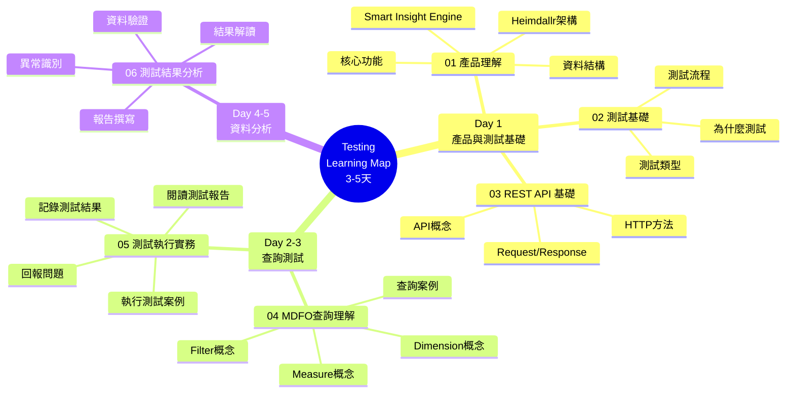

# Testing Learning Map - 測試專業能力大綱

---

## 設計原則

- **快速上手**: 3-5 天建立測試基礎概念
- **表層優先**: 從使用者視角理解測試，不深入系統內部
- **實務導向**: 聚焦實際會執行的測試任務
- **非技術友善**: 適合資訊背景較弱的 BA 角色

---

## 學習路徑概覽

### 📚 完整學習地圖 (01-06) - 總共 3-5 天
**目標**：理解產品與測試概念，能執行測試任務，能解讀測試結果

- 01：產品理解（0.5 天）
- 02-03：測試基礎概念（1-2 天）
- 04-05：查詢測試實務（1-2 天）
- 06：資料分析能力（1 天）

### 🗺️ 測試學習地圖

---

## 📋 完整大綱

### **01_product-understanding.md - 產品理解**
> 學習階段：Day 1 | 深度：概念理解

#### 1.1 Smart Insight Engine 產品定位
- **產品是什麼** - 營養補充品數據分析 API 引擎
- **解決什麼問題** - 提供靈活的多維度數據查詢與分析
- **核心價值** - 快速取得市場洞察、產品分析、趨勢追蹤

#### 1.2 Heimdallr 專案架構
- **Heimdallr 角色** - Django 專案，包含 Smart Insight Engine
- **系統架構** - 前端 UI + Backend API + Smart Insight Engine
- **查詢流程** - 使用者操作 → API 請求 → Engine 計算 → 回傳結果

#### 1.3 核心功能與業務邏輯
- **查詢功能** - 提供靈活的多維度數據查詢
- **分析功能** - 支援統計、聚合、分布等多種分析
- **業務場景** - 市場分析、產品比較、趨勢追蹤
- **保護機制** - 查詢限制、效能保護

#### 1.4 資料來源與結構
- **資料規模** - ~130K 產品數據
- **核心資料** - 產品資訊、品牌、成分、劑型、價格
- **分類法架構** - 階層式分類（Taxonomy）
- **資料品質考量** - 完整性、一致性、正確性

#### 1.5 測試角色的產品知識邊界
- **需要理解** - 產品功能、查詢邏輯、業務規則、資料結構
- **不需深入** - Engine 演算法、Django 技術細節、資料庫優化

---

### **02_testing-basics.md - 測試基礎概念**
> 學習階段：Day 1 | 深度：概念理解

#### 2.1 為什麼需要測試？
- 確保功能正確性
  - 使用者輸入 → 系統輸出 → 結果正確嗎？
- 發現問題
  - 功能不符合預期
  - 資料計算錯誤
  - 顯示結果有誤
- 預防退化
  - 新功能不影響舊功能
  - 修改後功能仍正常

#### 2.2 測試的類型
- **功能測試** - 功能是否正常運作
- **整合測試** - 不同部分一起運作是否正常
- **使用者測試** - 從使用者角度測試完整流程

#### 2.3 測試流程
- **1. 理解需求** - 這個功能應該做什麼？
- **2. 設計測試案例** - 如何驗證功能正確？
- **3. 執行測試** - 實際操作並記錄結果
- **4. 記錄問題** - 發現問題時清楚描述
- **5. 驗證修復** - 問題修復後重新測試

#### 2.4 測試案例設計思維
- **正向測試（Happy Path）** - 正常使用情況
- **負向測試（Error Case）** - 異常使用情況
- **邊界測試（Boundary）** - 極端情況

---

### **03_rest-api-basics.md - REST API 基礎**
> 學習階段：Day 1 | 深度：概念理解

#### 3.1 什麼是 API？
- API = Application Programming Interface（應用程式介面）
- **簡單理解**：前端與後端溝通的橋樑
- **REST API**：透過 HTTP 協定溝通的 API

#### 3.2 HTTP 基本概念
- **HTTP 方法** - GET, POST, PUT, DELETE
- **Request（請求）** - URL, Headers, Body
- **Response（回應）** - Status Code, Body

#### 3.3 JSON 格式理解
- 什麼是 JSON - 資料交換格式，易於閱讀
- 基本結構 - Object `{}`, Array `[]`, Key-Value pairs

#### 3.4 API 測試工具
- **Postman（推薦）** - 圖形介面，易於使用
- **瀏覽器開發者工具** - F12 → Network 分頁
- **測試重點** - Request, Response, Status Code 驗證

---

### **04_mdfo-query-understanding.md - MDFO 查詢理解**
> 學習階段：Day 2-3 | 深度：概念理解

#### 4.1 什麼是 MDFO 查詢？
- Smart Insight Engine 的查詢結構
- **M = Measure（指標）** - 要計算什麼
- **D = Dimensions（維度）** - 如何分組
- **F = Filters（篩選）** - 篩選條件
- **O = Options（選項）** - 其他設定

#### 4.2 Measure（指標）理解
- **計數類** - product_count, brand_count
- **聚合類** - avg_price, price_statistics
- **分析類** - co_occurrence_analysis

#### 4.3 Dimensions（維度）理解
- **單維度查詢** - 單一維度分組
- **多維度查詢** - 多個維度組合分組
- **測試重點** - 分組正確性、數量合理性

#### 4.4 Filters（篩選）理解
- **ANY (OR 邏輯）** - 任一條件符合
- **ALL (AND 邏輯）** - 全部條件符合
- **測試重點** - 篩選邏輯正確性

#### 4.5 查詢範例閱讀
- 理解查詢意義
- 識別 MDFO 各部分
- 預測查詢結果

---

### **05_test-execution-practice.md - 測試執行實務**
> 學習階段：Day 3-4 | 深度：實務操作

#### 5.1 JSON 測試案例執行
- **JSON 測試案例** - 測試案例結構、輸入與預期輸出
- **執行測試** - quick_test.py, test_case_runner.py
- **查看測試報告**

#### 5.2 閱讀測試報告
- **測試結果狀態** - PASS, FAIL, WARNING
- **測試報告內容** - 總數、通過/失敗數、失敗詳情
- **解讀失敗** - 比對預期 vs 實際、找出差異、判斷問題來源

#### 5.3 Postman 測試實務
- **建立 Request** - URL, Method, Body
- **執行 Request** - Send, 查看 Response, 檢查 Status Code
- **驗證結果** - 格式、內容、計算正確性

#### 5.4 前端 UI 測試（手動）
- **Quick Cards 測試** - 頁面操作、結果驗證
- **檢查項目** - UI 顯示、資料載入、數字合理性、錯誤訊息

#### 5.5 記錄測試結果
- **測試紀錄** - 案例編號、日期、結果、問題描述、截圖
- **Bug Report** - 標題、重現步驟、預期結果、實際結果、影響範圍

---

### **06_test-result-analysis.md - 測試結果分析**
> 學習階段：Day 4-5 | 深度：分析能力

#### 6.1 資料驗證基礎
- **完整性檢查** - 必填欄位、格式、數值範圍
- **一致性檢查** - 名稱統一、分類標準化
- **邏輯檢查** - 加總、百分比、分組遺漏

#### 6.2 分類法（Taxonomy）驗證
- **分類法** - 系統化分類結構
- **驗證重要性** - 階層錯誤影響查詢、名稱不一致影響統計
- **檢查項目** - 父子關係、重複、遺漏、名稱標準化

#### 6.3 測試結果解讀
- **從數字到洞察** - 正確性與合理性
- **商業分析視角** - 品牌分布、價格分析、成分分析、市場趨勢
- **異常識別** - 數值異常、缺失資料、邏輯錯誤

#### 6.4 SQL 基礎查詢（選修）
- **用途** - 驗證結果、資料統計、找出問題
- **基礎語法** - SELECT, WHERE, GROUP BY, COUNT, AVG
- **學習深度** - 能看懂簡單查詢即可

#### 6.5 測試報告撰寫
- **報告結構** - 測試摘要、關鍵發現、問題列表、建議
- **撰寫原則** - 清楚、簡潔、結構化、視覺化

---

## 學習階段規劃

### Day 1：產品理解與測試基礎
- 理解 Smart Insight Engine 與 Heimdallr
- 理解產品核心功能與資料結構
- 理解為什麼需要測試
- 理解測試類型與流程
- 理解 REST API 基本概念

---

### Day 2：MDFO 查詢理解
- 深入理解 MDFO 查詢結構
- 理解不同 Measure 的意義
- 理解 Dimension 與 Filter 的作用
- 閱讀實際查詢範例

---

### Day 3：測試執行實務
- 執行 JSON 測試案例
- 使用 Postman 測試 API
- 進行前端手動測試
- 記錄測試結果

---

### Day 4：測試報告與問題回報
- 閱讀測試報告
- 解讀測試結果
- 撰寫 Bug Report
- 記錄測試紀錄

---

### Day 5：資料分析與報告
- 進行資料驗證
- 識別資料異常
- 從測試結果提取洞察
- 撰寫測試報告

---

## 能力驗證標準

### 基礎能力（完成 3-5 天學習）
- ✅ 理解測試目的與流程
- ✅ 理解 REST API 與 JSON 基本概念
- ✅ 理解 MDFO 查詢結構
- ✅ 能執行 JSON 測試案例
- ✅ 能使用 Postman 測試 API
- ✅ 能進行前端手動測試
- ✅ 能閱讀並理解測試報告
- ✅ 能撰寫 Bug Report
- ✅ 能記錄測試結果

### 進階能力（透過實際專案學習）
- 🔄 能設計完整測試案例
- 🔄 能進行深度資料驗證
- 🔄 能使用 SQL 驗證資料
- 🔄 能從測試中提取商業洞察
- 🔄 能撰寫專業測試報告
- 🔄 能主導測試計畫

---

## 工具與資源

### 必備工具
- ✅ **Postman** - API 測試工具（圖形介面，易上手）
- ✅ **瀏覽器開發者工具** - 查看網路請求（F12 → Network）
- ✅ **Excel / Google Sheets** - 記錄測試結果
- ✅ **JSON 測試執行器** - quick_test.py（已準備好的腳本）

### 選用工具
- 📝 **DB Browser for SQLite** - 視覺化資料庫查詢工具（選修）
- 📝 **Screenshot 工具** - 截圖記錄問題

### 學習資源

#### 內部文檔（必讀）
- `tests/TEST_RUNNER_README.md` - 測試執行器使用指南
- `spec/Canonical_Query_Schema.md` - MDFO 查詢結構說明
- `spec/Measure_Reference.md` - 所有 Measure 的說明
- `tests/testcase/` - 測試案例範例

#### 內部文檔（參考）
- `tests/README.md` - 完整測試架構說明
- `tests/MULTI_DIMENSION_BUSINESS_TESTING.md` - 商業場景測試範例

#### 外部資源（選讀）
- **Postman 教學**: https://learning.postman.com/
- **JSON 格式**: https://www.json.org/json-zh.html
- **REST API 基礎**: https://restfulapi.net/

---

## 常見問題

### Q: 我不懂程式，可以做測試嗎？
A: 可以！這個學習地圖專為非技術背景設計。你需要的是「邏輯思考」和「細心觀察」，不需要寫程式。

### Q: 需要學習 Python 嗎？
A: 不需要。測試腳本已經寫好，你只需要「執行」即可。重點是理解測試概念與解讀結果。

### Q: Postman 難學嗎？
A: 不難。Postman 是圖形介面工具，比命令列友善很多。跟著教學操作幾次就會了。

### Q: SQL 一定要學嗎？
A: 不一定。基礎測試工作不需要 SQL。但如果想進行更深入的資料驗證，學習基礎 SQL 會很有幫助。

### Q: 測試報告怎麼寫？
A: 參考範本和現有報告，重點是「清楚描述問題」和「提供截圖證據」。格式不是重點，內容清楚最重要。

### Q: 如何知道自己準備好了？
A: 完成「能力驗證標準 - 基礎能力」的檢核項目，特別是能執行測試、理解結果、回報問題，就可以開始實際工作了。

---

## 與 General Learning Map 的關係

### General 已涵蓋（不重複）
- ❌ Git 基礎操作
- ❌ 測試為什麼重要（基本概念）
- ❌ Bug 報告撰寫基礎
- ❌ JSON 格式基礎
- ❌ API 基礎概念

### 本文件專注於
- ✅ Smart Insight Engine 與 Heimdallr 產品理解
- ✅ 產品核心功能與資料結構
- ✅ 測試流程與案例設計思維
- ✅ REST API 實務理解（Request/Response）
- ✅ MDFO 查詢結構深入理解
- ✅ JSON 測試案例執行
- ✅ Postman API 測試實務
- ✅ 前端手動測試方法
- ✅ 測試結果解讀與分析
- ✅ 資料驗證基礎
- ✅ 測試報告撰寫

---

## 下一步

完成這 3-5 天的學習後，建議：

1. **實際執行測試任務**
   - 從簡單的測試案例開始
   - 執行 → 記錄 → 回報
   - 逐步增加複雜度

2. **建立測試習慣**
   - 每次測試都記錄
   - 遇到問題就回報
   - 定期整理測試結果

3. **持續學習**
   - 遇到不懂的查文檔
   - 請教有經驗的同事
   - 參考現有測試案例

4. **能力累積路徑**
   - Week 1-2: 執行測試、記錄結果
   - Week 3-4: 理解測試邏輯、發現問題
   - Month 2-3: 設計測試案例、提出建議
   - Month 4+: 主導測試計畫、分析趨勢

---

**版本歷史**

| 版本 | 日期 | 變更內容 | 作者 |
|------|------|---------|------|
| 1.0 | 2025-11-10 | 初始版本 | Learning Team |
| 2.0 | 2025-11-10 | 重構為 3-5 天快速上手版本 | Learning Team |
| 3.0 | 2025-11-10 | 調整為非技術背景友善版本，移除 Django/Newman 深度內容 | Learning Team |
| 4.0 | 2025-11-10 | 新增產品理解章節 (01)，移除所有範例保持 outline 簡潔，章節重新編號為 01-06 | Learning Team |
