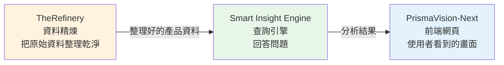
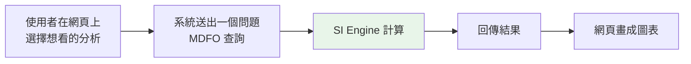
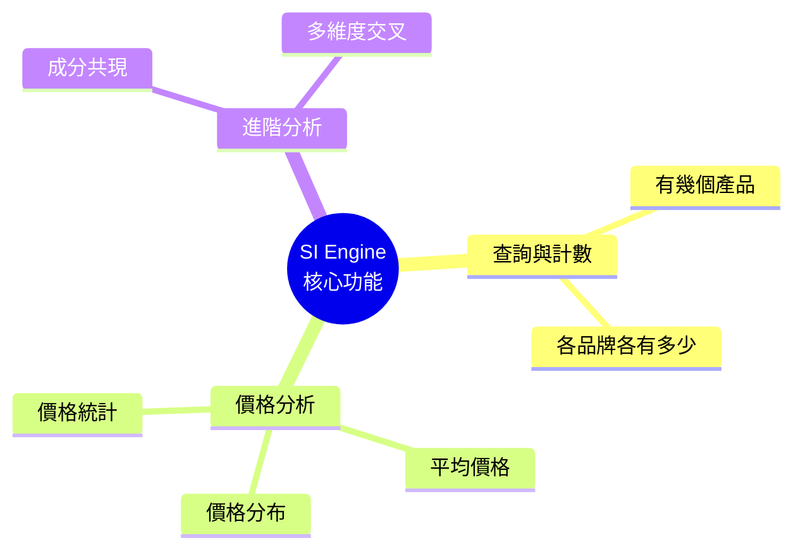
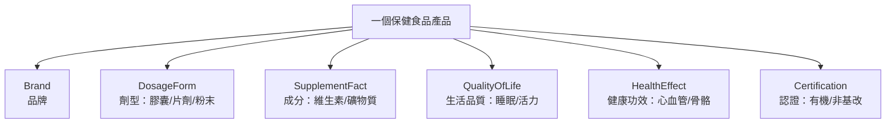

# 產品理解 - Smart Insight Engine

> 學習階段：Day 1 ｜ 深度：概念理解
> 目標讀者：測試與商業分析（BA）角色，不需要技術背景

---

## 📋 概述

在開始測試任何產品之前，你必須先知道「這個產品是做什麼的」。本章的目的不是要你懂程式，而是要你能用一句話向別人解釋：**Smart Insight Engine 是什麼、幫誰解決什麼問題**。

讀完本章後，你會理解：

- Smart Insight Engine 的產品定位（一個回答營養補充品市場問題的引擎）
- 它在 LuminNexus 整體系統中的位置（資料從哪來、結果送到哪去）
- 它能回答哪些類型的問題（核心功能）
- 它背後的資料長什麼樣子（13 萬筆產品、13 個維度）

> 💡 這一章是「地圖」，後續章節（例如 [04_mdfo-query-understanding](./00_outline.md)）才會帶你走進地圖裡的細節。

---

## 🧭 核心概念

### 1. Smart Insight Engine 是什麼？

**一句話定位**：Smart Insight Engine（簡稱 SI Engine）是一個「營養補充品數據分析引擎」，讓人可以用簡單的問句，從約 13 萬筆保健食品資料中，快速取得市場洞察。

可以把它想像成一位**很懂保健食品的資料助理**：

- 你問它：「Nature Made 這個品牌的產品，價格分布怎麼樣？」
- 它幫你查完所有資料，回你一張清楚的分布結果。

**它解決什麼問題？**

過去要回答這類問題，需要工程師手寫複雜的資料庫查詢語法（SQL），既慢又容易出錯。SI Engine 把這件事變簡單：使用者只要描述「想要什麼」，引擎會自動處理背後所有技術細節。

**核心價值**：

| 價值 | 說明 |
|------|------|
| 快速洞察 | 幾秒鐘內回答市場、產品、趨勢類問題 |
| 領域專屬 | 內建保健食品的業務邏輯，不是通用工具 |
| 結果一致 | 相同問題每次得到相同格式的答案，方便比較與驗證 |

> 🔎 **對測試角色的意義**：因為結果格式固定、邏輯明確，測試時你才能判斷「這個答案到底對不對」。這正是你的工作重點。

### 2. 它在 LuminNexus 三層架構中的位置

SI Engine 不是單獨存在的，它是 LuminNexus 這個大系統中的**中間那一層**。資料像水一樣，從上游流進來、經過它處理、再流向下游給使用者看。

- **上游 TheRefinery**：負責把來自各處的原始資料清洗、整理、分類，交出一份乾淨的產品資料。
- **中間 Smart Insight Engine**：接收乾淨資料，負責「回答問題、做分析」。這是你要測試的核心。
- **下游 PrismaVision-Next**：使用者實際操作的網頁介面，把引擎的分析結果變成好看的圖表。

> ⚠️ **重要術語對照**：你在不同文件中會看到不同名字，它們指的是相關的東西：
> - **PrismaVision**：專案文件（也就是本學習地圖 projects/ 目錄）中對這整個產品線的稱呼。
> - **Heimdallr**：是**承載 Smart Insight Engine 的 Django 專案名稱**（Django 是一種建構網站後端的技術框架）。當工程師提到 Heimdallr，多半是指程式碼實際存放的那個專案。
> - 你不需要懂 Django，只要知道「Heimdallr 這個名字 = 裝著 SI Engine 的那個技術專案」即可。

### 3. 使用者怎麼跟它互動？

從使用者角度看，互動流程非常單純：

中間那個「問題」有個正式名字叫 **MDFO 查詢**，這是你之後會反覆遇到的核心概念，下一節先建立初步印象。

---

## 🔧 實務理解

### MDFO：問問題的固定格式

SI Engine 聽得懂的「問題」不是自由發揮的中文，而是一種固定結構，叫 **MDFO 查詢**。MDFO 是四個英文字的縮寫，代表一個問題的四個部分：

| 字母 | 名稱 | 白話意思 | 舉例 |
|------|------|----------|------|
| **M** | Measure（度量） | 你想「算什麼」 | 產品數量、平均價格、價格分布 |
| **D** | Dimensions（維度） | 你想「怎麼分組看」 | 依品牌分、依成分分 |
| **F** | Filters（過濾） | 你只想看「哪些資料」 | 只看 Nature Made 品牌 |
| **O** | Options（選項） | 結果「怎麼呈現」 | 最多顯示 100 筆 |

把它們組合起來，就像在點餐時說清楚：「我要**一份**（Measure）**炒飯**（Dimension），**不要蔥**（Filter），**外帶**（Option）。」

**一個實際例子**：

問題：「Nature Made 品牌的產品，價格分布如何？」

拆解成 MDFO：
- **M**：價格分布（price_distribution）
- **D**：不分組（看整體）
- **F**：只看 Nature Made 品牌
- **O**：每 10 元一個級距

引擎回你：$0–10 有 45 個產品、$10–20 有 128 個產品……以此類推。

> 💡 你現在不需要會「寫」MDFO，只要能「看懂」一個 MDFO 問題在問什麼。設計與撰寫是後面章節的事。

### 核心功能：它能回答哪些問題？

SI Engine 的功能可歸為三大類，測試時你會針對這些功能設計驗證：

- **查詢與計數**：例如「維他命 C 產品總共有幾個？」「各品牌各有多少？」
- **價格分析**：平均價格、價格分布（分級距）、價格統計（最高、最低）。
- **進階分析**：例如「哪些成分常常一起出現在同一個產品裡？」

此外，系統還有**保護機制**：為了不讓查詢拖垮系統，會限制單次回傳筆數、限制過於龐大的查詢。測試時如果遇到「結果被截斷」或「查詢被拒絕」，這可能是正常的保護行為，而不是 bug——判斷這一點正是測試角色的價值。

### 資料結構：13 萬筆產品、13 個維度

引擎背後有一份龐大的資料，理解它的樣貌能幫助你判斷結果合不合理。

- **資料規模**：約 **13 萬（130K）筆**保健食品產品。
- **13 個維度**：「維度」就是**看待產品的不同角度**。同一個產品，可以從「它是哪個品牌」「它是什麼劑型」「它含哪些成分」等不同角度來分類。

用商業語言理解「維度」：想像一間超市的商品，你可以問「這是哪個牌子的？」「這是膠囊還是粉末？」「它宣稱能改善睡眠還是增強活力？」——每一種問法就是一個維度。

上圖只列出常見的幾個維度，實際共有 13 個。你不需要背下全部，只要理解「產品可以被多角度分類」這個概念即可。

**資料品質是測試重點**：因為資料來自上游整理，測試時要留意三件事：

- **完整性**：某些產品是否缺欄位（例如沒有價格）？
- **一致性**：同一個品牌名稱有沒有拼法不一（Nature Made vs Nature-Made）？
- **正確性**：分類是否合理（把礦物質誤標成維生素）？

### 測試角色的知識邊界

最後，明確你「該懂到哪裡」：

| ✅ 你需要理解 | ❌ 你不需要深入 |
|--------------|----------------|
| 產品能回答哪些問題 | 引擎內部的計算演算法 |
| MDFO 問題在問什麼 | Django 等技術框架細節 |
| 業務規則與保護機制 | 資料庫索引與效能優化 |
| 資料維度與品質要點 | SQL 語法如何生成 |

> 🎯 一句話：你站在**使用者與業務的角度**理解產品，而不是站在工程師角度理解實作。

---

## ❓ 常見問題 FAQ

**Q1：我完全沒有技術背景，能做這份測試工作嗎？**
可以。測試角色的核心能力是「判斷結果對不對、把問題講清楚」，這靠的是細心與業務理解，不是寫程式。本學習地圖刻意避開技術實作細節。

**Q2：Heimdallr、PrismaVision、Smart Insight Engine，到底是什麼關係？**
Smart Insight Engine 是「引擎功能」本身；Heimdallr 是「裝著這個引擎的技術專案名」；PrismaVision 是專案文件中對整個產品線的稱呼。三者指向相關的同一件事，日常溝通用「SI Engine」即可。

**Q3：MDFO 和 MDOF 有什麼不同？**
指的是同一種查詢結構（Measure / Dimensions / Filters / Options）。本學習地圖統一使用 **MDFO**；你在部分產品教材與檔名中會看到沿用舊拼法 MDOF，兩者是同一件事。

**Q4：13 個維度我要全部背起來嗎？**
不用。理解「維度＝看待產品的角度」這個概念最重要。實際測試時需要哪個維度，再查對照即可。

**Q5：查詢結果只回傳一部分，是 bug 嗎？**
不一定。系統有保護機制會限制回傳筆數。判斷是「保護行為」還是「真的漏資料」，需要對照需求規格——這正是測試角色要做的判斷。

---

## 🔗 相關文檔

- [smart-insight-engine/00_overview.md](../../projects/prismavision/smart-insight-engine/00_overview.md) —— SI Engine 深度學習教材（含完整架構圖與 MDFO 細節）
- [smartinsightengine.md](../../projects/prismavision/smartinsightengine.md) —— 查詢引擎快速概覽（Input/Output 格式）
- [02_testing-basics.md](./02_testing-basics.md) —— 下一章：測試基礎概念
- [00_outline.md](./00_outline.md) —— 測試角色學習大綱

---

## 📝 版本歷史

| 版本 | 日期 | 作者 | 變更說明 |
|------|------|------|----------|
| 1.0 | 2026-07-05 | maple | 初版建立 |
