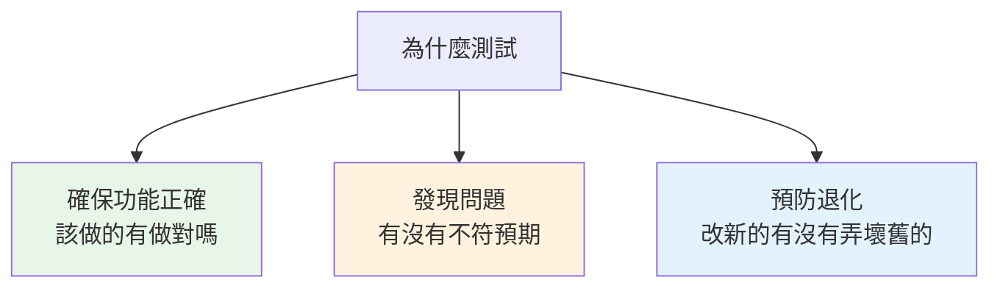
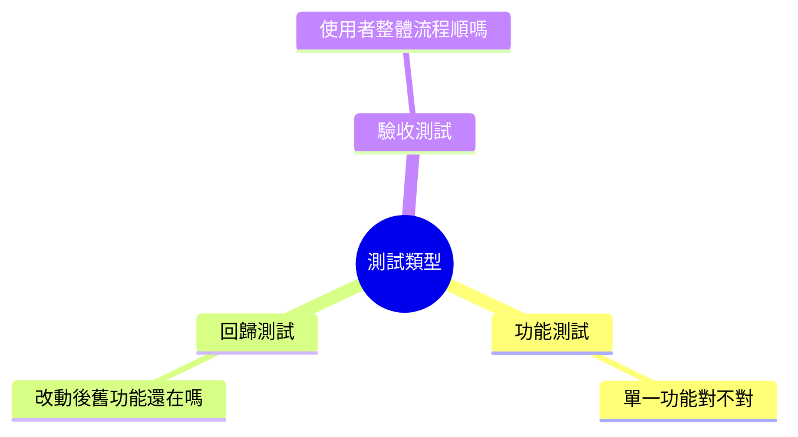
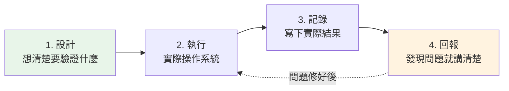
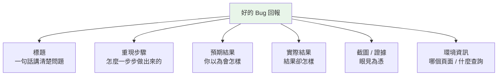

# 測試基礎概念

> 學習階段：Day 1 ｜ 深度：概念理解
> 目標讀者：測試與商業分析（BA）角色，不需要技術背景

---

## 📋 概述

上一章你認識了要測試的產品（[Smart Insight Engine](./01_product-understanding.md)）。這一章談的是「測試」這件事本身：**為什麼要測、有哪些測法、怎麼一步步測、發現問題後怎麼講清楚**。

讀完本章後，你會理解：

- 測試的目的（用日常生活的例子理解）
- 幾種常見的測試類型（表層認識即可）
- 一次完整測試的標準流程
- 一份「好的 bug 回報」長什麼樣

> 💡 測試不是「找碴」，而是「在使用者遇到問題之前，先替他們遇到」。這是測試角色的核心價值。

---

## 🧭 核心概念

### 1. 為什麼需要測試？

想像你買了一台新洗衣機。出廠前，工廠一定會試轉幾次：**放水正常嗎？會不會漏水？脫水會不會太吵？** 這個「出廠前先試用」的動作，就是測試。

如果工廠不測就出貨，問題會由買家在家裡發現——那時候修理成本更高、信任也沒了。軟體也一樣：**在使用者遇到問題之前先發現它，成本最低、傷害最小。**

測試主要達成三個目的：

- **確保功能正確**：使用者輸入一個問題，系統給的答案對嗎？例如查「維他命 C 產品數量」，回傳的數字合理嗎？
- **發現問題**：功能不符合預期、資料算錯、畫面顯示有誤，都要抓出來。
- **預防退化**：「退化」指的是**本來好好的功能，因為改了別的東西而壞掉**。這是最容易被忽略、也最需要測試把關的地方。

### 2. 測試的類型（表層認識）

測試有很多種類，你不需要成為理論專家，先認得以下幾種最常用的即可：

| 類型 | 白話解釋 | 在 SI Engine 的例子 |
|------|----------|---------------------|
| **功能測試** | 單一功能是否正常運作 | 「價格分布」查詢能不能算出正確結果 |
| **回歸測試** | 改了東西後，舊功能是否還正常 | 新增一個維度後，原本的品牌查詢還對不對 |
| **驗收測試** | 從使用者角度，整個流程走得通嗎 | 使用者從網頁選查詢到看到圖表，一路順不順 |

**怎麼記？** 用一句話串起來：功能測試看「**這一顆螺絲**鎖緊了嗎」，回歸測試看「**鎖新螺絲時有沒有弄鬆舊的**」，驗收測試看「**整台機器**使用者用起來順不順」。

> 🔎 你還會聽到「正向測試」「負向測試」「邊界測試」等說法，那是**設計測試案例**時的思維角度（正常情況、異常情況、極端情況）。想深入時可讀深度教材 [03_test-case-design.md](../../projects/prismavision/smart-insight-engine/03_test-case-design.md)（進階），這裡先有印象即可。

### 3. 測試的標準流程

一次完整的測試，不是隨手點一點，而是有固定步驟。可以濃縮成四個動作：**設計 → 執行 → 記錄 → 回報**。

- **1. 設計**：先理解「這個功能應該做什麼」，再想「我要怎麼驗證它對不對」。例如：查 Nature Made 品牌，我預期會看到只屬於這個品牌的產品。
- **2. 執行**：實際操作系統，送出查詢、觀察結果。
- **3. 記錄**：把「我做了什麼」「得到什麼結果」如實寫下，不論成功或失敗。
- **4. 回報**：如果結果和預期不符，寫成一份清楚的 bug 回報（下一節詳談）。修好之後，回到步驟 2 重新驗證（這就是回歸測試）。

> ⚠️ 最容易被跳過的是「**設計**」。如果沒有先想清楚「正確答案該長怎樣」，你就無法判斷實際結果對不對。先有預期，才能比對。

---

## 🔧 實務理解

### 什麼是一份「好的」bug 回報？

發現問題只是第一步。如果你回報得含糊，工程師看不懂、重現不了，問題就修不好。**一份好的 bug 回報，要讓沒看過現場的人也能照著重現。**

一份合格的 bug 回報包含以下要素：

**逐項說明**：

| 要素 | 為什麼重要 | 反例（不好的寫法） |
|------|-----------|-------------------|
| **標題** | 讓人一眼知道問題 | 「壞了」 |
| **重現步驟** | 讓別人能照做出同樣問題 | 「我點了幾下就錯了」 |
| **預期 vs 實際** | 說明「錯在哪」的關鍵 | 只寫「不對」，沒說哪裡不對 |
| **截圖 / 證據** | 文字講不清的用畫面補 | 完全沒附圖 |
| **環境資訊** | 幫助定位問題範圍 | 沒說在哪個頁面、查了什麼 |

**核心三要素：重現步驟、預期 vs 實際、截圖**——這三樣是 bug 回報的骨幹，缺一不可。

### 範例對照：從「不好」到「好」

**❌ 不好的 bug 回報：**

> 價格查詢好像怪怪的，數字不對，麻煩看一下。

工程師看到只能反問：哪個查詢？什麼品牌？哪個數字？怎麼不對？——來回好幾輪還沒開始修。

**✅ 好的 bug 回報：**

> **標題**：查詢 Nature Made 價格分布時，$0–10 級距的產品數異常為 0
>
> **環境**：PrismaVision-Next 網頁，價格分布分析頁面
>
> **重現步驟**：
> 1. 進入「價格分布」分析頁
> 2. 品牌篩選選擇「Nature Made」
> 3. 級距設為每 10 元
> 4. 點擊「查詢」
>
> **預期結果**：$0–10 級距應顯示約 45 個產品（依先前資料）
>
> **實際結果**：$0–10 級距顯示 0 個產品，其餘級距正常
>
> **證據**：（附上結果畫面截圖）

這樣寫，工程師能直接照步驟重現、快速定位，修復效率天差地別。

> 💡 一個判斷標準：把你的 bug 回報拿給一個沒看過現場的同事，他能不能照著做出同樣的錯誤？如果可以，這就是一份好回報。

---

## ❓ 常見問題 FAQ

**Q1：測試就是「把系統點爆」嗎？**
不是。測試是有計畫地驗證「功能是否符合預期」。你要先知道「正確答案該長怎樣」，再去比對實際結果，而不是亂點一通。

**Q2：功能測試和回歸測試差在哪？**
功能測試看「這個功能本身對不對」；回歸測試看「改了別的東西後，這個原本正常的功能有沒有被弄壞」。同一個測試案例，第一次跑是功能測試，改動後再跑一次就是回歸測試。

**Q3：我不會寫程式，怎麼判斷結果對不對？**
靠業務理解與對照需求。例如你知道 Nature Made 是知名大品牌，若查出來只有 2 個產品，這個數字就「不合理」，值得深入查。判斷力來自對產品與資料的熟悉，不是程式能力。

**Q4：發現問題但不確定是不是 bug，該回報嗎？**
該。與其自己猜，不如如實記錄「我做了什麼、得到什麼、我覺得哪裡怪」，交由團隊判斷。記得參考上一章提到的「保護機制」——有些看似異常的行為其實是系統的正常設計。

**Q5：一定要附截圖嗎？**
強烈建議。文字容易有歧義，一張截圖能省下大量來回確認。若涉及數字，最好連同查詢條件一起截下來。

---

## 🔗 相關文檔

- [01_product-understanding.md](./01_product-understanding.md) —— 上一章：認識要測試的產品
- [smart-insight-engine/03_test-case-design.md](../../projects/prismavision/smart-insight-engine/03_test-case-design.md) —— 深度教材：測試案例設計（進階，位於產品學習路徑）
- [00_outline.md](./00_outline.md) —— 測試角色學習大綱

---

## 📝 版本歷史

| 版本 | 日期 | 作者 | 變更說明 |
|------|------|------|----------|
| 1.0 | 2026-07-05 | maple | 初版建立 |
| 1.1 | 2026-07-07 | maple | 正向/負向/邊界測試改為明確指向深度教材（原「後續章節細談」無對應章節） |
