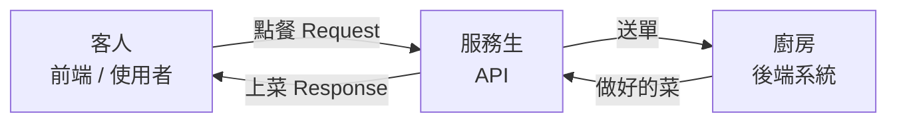
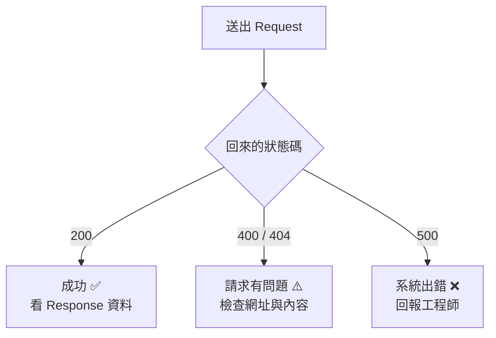

# REST API 基礎

---

## 📋 概述

身為測試與商業分析人員，你不需要會「寫」API，但你需要能「看懂」API 在傳什麼、
回什麼，這樣才能判斷產品的行為是否正確。

本章用生活化的比喻帶你認識 API 的基本樣貌：

- API 是什麼（餐廳點餐的比喻）
- HTTP 方法：GET / POST 的差別（表層即可）
- Request（請求）與 Response（回應）的結構
- 常見狀態碼：200 / 400 / 404 / 500 的意思
- 在哪裡可以親眼看到這些內容（Postman、瀏覽器 F12）

> 目標：看到一段 API 內容時，能大致說出「這是在問什麼、回了什麼、成功還是失敗」。

---

## 核心概念

### 1. 什麼是 API？用餐廳點餐來理解

想像你去餐廳吃飯：

- 你（**客人**）不會直接衝進廚房煮菜
- 你看**菜單**點餐，把需求告訴**服務生**
- 服務生把需求送進**廚房**，廚房做好後再由服務生把菜端出來

**API 就是這位服務生**。它是「前端畫面」與「後端系統」之間的橋樑：

- 你（前端 / 使用者）想要某些資料
- API 負責把你的要求送到後端，再把結果送回來
- 你不需要知道廚房（後端）怎麼運作，只要會「點餐」與「收菜」



**API** = Application Programming Interface（應用程式介面）。
其中 **REST API** 只是最常見的一種 API 形式，它透過網路上的 **HTTP** 協定來溝通，
就像服務生用固定的一套流程幫你點餐、上菜。

### 2. HTTP 方法：你想對資料做什麼？

點餐有不同動作：「我要查菜單」跟「我要下一筆新訂單」是不同的事。
HTTP 方法就是用來表達「你想對資料做什麼動作」，最常見的兩個：

| 方法 | 白話意思 | 餐廳比喻 |
|------|---------|---------|
| **GET** | 「給我看資料」（查詢，不會改動任何東西） | 看菜單、問今天有什麼 |
| **POST** | 「幫我新增一筆」（送出資料、建立新東西） | 下一筆新訂單 |

> 你可能也會聽到 PUT（修改）、DELETE（刪除），但測試工作中最常遇到的是
> **GET（查資料）** 與 **POST（送出查詢）**，先掌握這兩個就夠了。

一個重點：**GET 只是「看」，不會改變後端的資料**；
而 **POST 是「送出」東西**，例如把一段查詢條件送給系統去計算。
在我們的產品裡，查詢資料常常是用 POST 把查詢條件送出去。

### 3. Request 與 Response：一來一回

每一次 API 溝通都是「一問一答」：

- **Request（請求）** = 你送出去的「點餐單」
- **Response（回應）** = 系統送回來的「菜」

#### Request（請求）長什麼樣？

一張點餐單通常包含三個部分：

| 部分 | 白話意思 | 餐廳比喻 |
|------|---------|---------|
| **URL** | 要去哪個「櫃台」問 | 哪一家分店、哪個窗口 |
| **Headers** | 附註資訊（身分、格式） | 「我是會員」、「我要中文菜單」 |
| **Body** | 詳細要求內容 | 訂單細節：要什麼、幾份 |

#### Response（回應）長什麼樣？

系統回來的內容通常包含：

- **Status Code（狀態碼）** — 這次成功還是失敗（下一節說明）
- **Body** — 實際的資料內容，通常是 **JSON** 格式

### 4. JSON：資料的「表格化」寫法

**JSON** 是 API 傳資料時最常用的格式，它的好處是人也讀得懂。
它長得像一組「欄位名稱：值」的清單，用大括號 `{ }` 包起來。

下面是一段回應的 JSON 範例，右側是白話解釋：

```json
{
  "status": "success",     // 這次查詢成功
  "brand": "Nature Made",  // 品牌名稱
  "product_count": 128,    // 這個品牌有 128 個產品
  "in_stock": true         // 目前有庫存（true=是, false=否）
}
```

逐欄看懂：

- `"status": "success"` — 冒號左邊是**欄位名稱**，右邊是**值**
- 文字要用雙引號 `" "` 包起來（例如品牌名稱）
- 數字不用引號（例如 `128`）
- `true` / `false` 代表「是 / 否」

你也會看到兩種常見的包裝符號：

- 大括號 `{ }` = 一筆資料（一個物件，像一張卡片）
- 中括號 `[ ]` = 一串清單（多筆資料排在一起）

```json
{
  "brands": ["Nature Made", "NOW Foods", "Doctor's Best"]
  // brands 是一個清單，裡面有三個品牌名稱
}
```

### 5. 狀態碼：這次成功還是失敗？

每次回應都會帶一個**狀態碼（Status Code）**，用數字快速告訴你結果。
你不需要背全部，記住這四個最常見的就很夠用：

| 狀態碼 | 白話意思 | 誰的問題？ |
|--------|---------|-----------|
| **200** | 成功，一切正常 | 沒問題 |
| **400** | 你送的要求有錯（例如格式不對、少填欄位） | 通常是「請求方」的問題 |
| **404** | 找不到（網址錯了、資料不存在） | 通常是「請求方」的問題 |
| **500** | 系統自己出錯了 | 「後端系統」的問題 |

一個好記的分類法：

- **2 開頭**（如 200）= 成功 ✅
- **4 開頭**（如 400、404）= 你（請求方）弄錯了 ⚠️
- **5 開頭**（如 500）= 系統壞了 ❌



> 測試時很重要的一件事：**看到 500 不代表是你操作錯**，
> 而是後端出了狀況，這時要清楚記錄下來回報給工程師。

---

## 實務理解

### 你會在哪裡看到這些東西？

上面講的 Request、Response、狀態碼，不是抽象概念，你可以「親眼看到」它們。
主要有兩個地方（詳細操作會在 **05 測試執行實務** 章節帶你動手做）：

**1. Postman（推薦，圖形介面）**

- 一個專門用來測 API 的工具，全程用滑鼠點選，不用寫程式
- 你可以在裡面填好 URL、選 GET 或 POST、送出請求
- 送出後，畫面會清楚顯示回來的**狀態碼**和 **JSON 內容**

**2. 瀏覽器開發者工具（F12 → Network 分頁）**

- 在網頁上按 **F12** 打開開發者工具，切到 **Network（網路）** 分頁
- 操作網頁時，你會看到背後每一次 API 的請求與回應
- 點進某一筆，就能看到它的網址、狀態碼、送出的內容與回來的資料

### 測試時你主要看三件事

1. **Request 對不對** — 送出的網址、方法、內容是否符合預期
2. **Status Code 對不對** — 該成功的是不是 200？該擋掉的錯誤是不是 400？
3. **Response 對不對** — 回來的資料內容、數量是否合理

---

## ❓ 常見問題 FAQ

**Q1：我不會寫程式，需要看得懂 API 嗎？**
需要「看懂」，不需要「會寫」。你的工作是判斷產品行為對不對，
所以要能讀懂送出去和回來的內容，但不需要自己寫程式去呼叫 API。

**Q2：GET 和 POST 到底差在哪？**
最簡單的記法：**GET 是「看」資料（不改動任何東西）**，
**POST 是「送出」東西給系統處理**。在我們的產品中，把查詢條件送出去計算通常用 POST。

**Q3：看到 500 錯誤是我測錯了嗎？**
不一定。500 是**系統自己出錯**，多半不是你的操作問題。
遇到時請清楚記下你做了什麼、送了什麼，然後回報工程師。

**Q4：JSON 看起來好複雜，有訣竅嗎？**
先抓大架構：`{ }` 是一筆資料、`[ ]` 是一串清單。
再一行一行看「欄位名稱：值」。文字有引號、數字沒有、`true/false` 是是非。
看多了就會很快。

**Q5：我一定要用 Postman 嗎？**
Postman 對非技術者最友善，所以我們推薦它。
若只是想快速看網頁背後的 API，用瀏覽器 F12 的 Network 分頁也可以。

---

## 🔗 相關文檔

- [00_outline.md](00_outline.md) — Testing 角色學習大綱
- [04_mdfo-query-understanding.md](04_mdfo-query-understanding.md) — 下一章：MDFO 查詢理解
- [05_test-execution-practice.md](05_test-execution-practice.md) — 動手用 Postman 與 F12 實際操作

---

## 📝 版本歷史

| 版本 | 日期 | 作者 | 說明 |
|------|------|------|------|
| 1.0 | 2026-07-05 | maple | 初版建立 |
