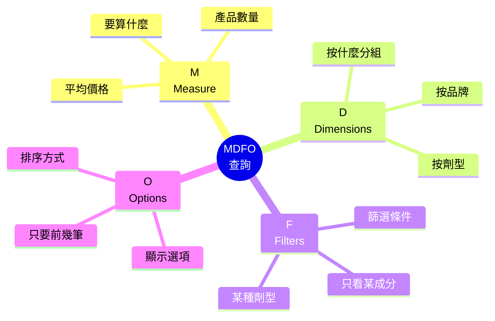
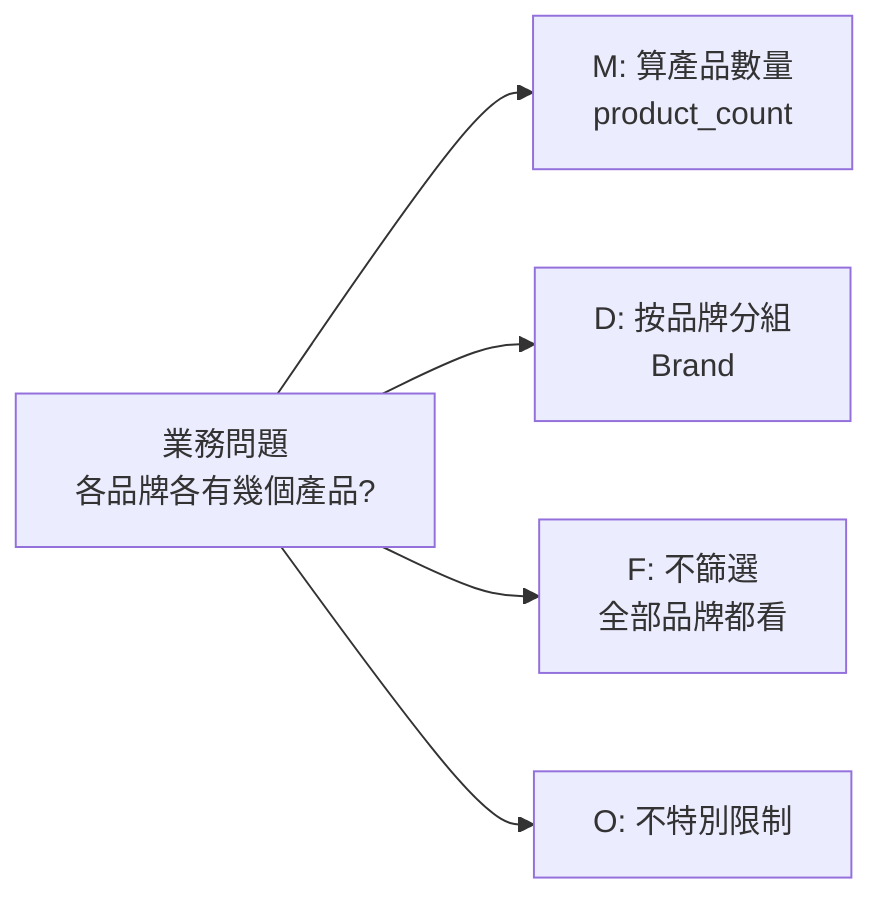

# MDFO 查詢理解

---

## 📋 概述

Smart Insight Engine 是一個「查產品資料」的系統。使用者不是用滑鼠一頁頁翻，
而是送出一段**查詢條件**，系統就會算出答案回來。這段查詢條件的結構就叫 **MDFO**。

身為測試與商業分析人員，你要能**看懂一段 MDFO 查詢在問什麼**，
並判斷回來的結果合不合理。你不需要自己寫複雜查詢，只要能讀懂它的四個部分。

> **術語註記**：這個查詢結構的正式拼法是 **MDFO**
> （Measure / Dimensions / Filters / Options）。
> 深度教材的檔名沿用早期拼法 **MDOF**，兩者指的是同一件事，看到時不用困惑。

本章涵蓋：

- MDFO 是什麼（用「點餐單」與「Excel 樞紐分析」比喻）
- 四個元素各自的商業意義與極簡範例
- 一個完整的業務問題 → MDFO 查詢對照範例

---

## 核心概念

### 1. MDFO 是什麼？兩個比喻

**比喻一：一張「數據點餐單」**

想像你請一位數據助理幫你查資料，你會怎麼說？

> 「幫我**算產品數量**（要算什麼），**按品牌分組**（怎麼分），
> **只看維生素 C 的產品**（篩哪些），**結果只要前 10 筆**（怎麼呈現）。」

這句話剛好就是 MDFO 的四個部分。

**比喻二：Excel 的樞紐分析表**

如果你用過 Excel 樞紐分析，會更好懂：

- **要放什麼「值」去計算**（例如：產品數量）→ 這就是 **M**
- **要用什麼欄位當「列 / 分組」**（例如：品牌）→ 這就是 **D**
- **要先「篩選」掉哪些資料**（例如：只看某種成分）→ 這就是 **F**
- **其他呈現設定**（例如：只顯示前幾名、怎麼排序）→ 這就是 **O**



**一句話記住四元素：**

| 元素 | 你在問 | 白話 |
|------|--------|------|
| **M** = Measure（指標） | 「要**算什麼**？」 | 產品數量、平均價格 |
| **D** = Dimensions（維度） | 「按**什麼分組**？」 | 按品牌、按劑型 |
| **F** = Filters（篩選） | 「只看**哪些資料**？」 | 只看維生素 C 產品 |
| **O** = Options（選項） | 「怎麼**呈現**？」 | 只要前 10 筆、排序 |

### 2. 四個元素的商業意義

#### M — Measure（要算什麼）

Measure 決定這次查詢「算出的是什麼數字」。沒有它，就只是一堆原始資料；
有了它，才會變成有意義的統計結果。常見的例如：

- `product_count` — 產品**數量**
- `avg_price` — **平均**價格

```json
{ "measure": "product_count" }   // 這次要算「產品數量」
```

#### D — Dimensions（按什麼分組）

Dimensions 決定結果「怎麼被切開來看」，就像樞紐分析的分組欄位。

- 空的 `[]` = 不分組，算出一個總數
- `["Brand"]` = 按品牌分開，各品牌各一個數字

```json
{ "dimensions": ["Brand"] }   // 按「品牌」分組
```

#### F — Filters（只看哪些資料）

Filters 決定這次「只納入哪些產品」。它有兩種邏輯，測試時很重要：

- **any（任一符合就算，OR 邏輯）** — 條件放寬，像「維生素 C **或** 維生素 D 都要」
- **all（全部都要符合，AND 邏輯）** — 條件收緊，像「必須**同時**是有機**且**膠囊」

```json
{
  "filters": {
    "any": { "SupplementFact": ["Vitamin C"] },  // 只看含維生素 C 的產品
    "all": {}                                     // 沒有額外的必要條件
  }
}
```

> 測試重點：把 `any` 想成「符合任一個就收」，`all` 想成「每一個都要符合」。
> 兩者的結果數量通常差很多，是很容易出錯、值得驗證的地方。

#### O — Options（怎麼呈現）

Options 決定結果「怎麼顯示」，例如只要前幾筆、要不要排序。它不改變資料本身。

```json
{ "options": { "limit": 10 } }   // 結果只要前 10 筆
```

### 3. 把四塊拼起來

一段完整的 MDFO 查詢，就是這四塊組合在一起：

```json
{
  "measure": "product_count",                    // M：算產品數量
  "dimensions": ["Brand"],                       // D：按品牌分組
  "filters": {
    "any": { "SupplementFact": ["Vitamin C"] },  // F：只看維生素 C 產品
    "all": {}
  },
  "options": { "limit": 10 }                     // O：只要前 10 筆
}
```

---

## 實務理解

### 完整範例：從業務問題到 MDFO 查詢

這是你日常最常做的事——把一句「業務問題」對照成一段 MDFO 查詢，
再看回來的結果合不合理。

**業務問題：**

> 「各品牌各有幾個產品？」

**拆解成 MDFO 四塊：**



| 元素 | 這題怎麼填 | 為什麼 |
|------|-----------|--------|
| **M** | `product_count` | 因為問的是「幾個產品」→ 要算數量 |
| **D** | `["Brand"]` | 因為問「**各品牌**」→ 要按品牌分組 |
| **F** | 空（`any` / `all` 都空） | 沒有限定成分或劑型，所有產品都算 |
| **O** | 空（或設個 limit） | 沒特別要求呈現方式 |

**對應的查詢：**

```json
{
  "measure": "product_count",   // 算產品數量
  "dimensions": ["Brand"],      // 按品牌分組
  "filters": { "any": {}, "all": {} },  // 不篩選
  "options": {}
}
```

**該怎麼看回來的結果？**

回來的內容大致會是「每個品牌 + 它的產品數量」的清單。你要驗證的是：

- 分組對不對？——每個品牌是不是各一列，沒有重複或漏掉
- 數量合不合理？——某品牌顯示 0 個或異常巨大，都值得追問
- 加總合不合理？——各品牌數量加起來，應該接近整體產品總數

### 讀懂一段查詢的三步驟

看到別人寫的 MDFO 查詢時，照這個順序讀：

1. 先看 **measure** → 這在算什麼？（數量？平均價格？）
2. 再看 **dimensions** → 結果會怎麼分組？
3. 最後看 **filters** → 只納入了哪些資料？（特別注意 any 還是 all）

抓住這三點，你就能預測「這個查詢大概會回什麼」，進而判斷結果對不對。

---

## ❓ 常見問題 FAQ

**Q1：MDFO 和 MDOF 是不同東西嗎？**
是同一件事。正式拼法是 **MDFO**（Measure / Dimensions / Filters / Options），
但深度教材檔名沿用早期的 **MDOF**。看到哪個都指同一個查詢結構。

**Q2：我需要自己寫查詢嗎？**
測試工作主要是**讀懂**查詢、判斷結果對不對，通常不需要從零手寫複雜查詢。
能看懂四個元素、預測結果，就達標了。

**Q3：filters 的 any 和 all 我老是搞混。**
記法：**any = 任一個符合就收（OR，範圍大）**、
**all = 每一個都要符合（AND，範圍小）**。兩者結果數量常差很多，是驗證重點。

**Q4：dimensions 是空的 `[]` 代表什麼？**
代表「不分組」，系統會算出一個整體總數。
一旦填了欄位（如 `["Brand"]`），就會按那個欄位切開來分別計算。

**Q5：Options 會影響數字對錯嗎？**
一般不會。Options 多半只影響「怎麼呈現」（例如只顯示前 10 筆、排序），
不改變底層資料。真正影響「算什麼、算多少」的是 M、D、F 三塊。

---

## 🔗 相關文檔

- [00_outline.md](00_outline.md) — Testing 角色學習大綱
- [03_rest-api-basics.md](03_rest-api-basics.md) — 上一章：REST API 基礎
- [01_mdof-fundamentals.md](../../projects/prismavision/smart-insight-engine/01_mdof-fundamentals.md)
  — MDFO 深度教材（內容較深，挑需要的章節讀即可）

---

## 📝 版本歷史

| 版本 | 日期 | 作者 | 說明 |
|------|------|------|------|
| 1.0 | 2026-07-05 | maple | 初版建立 |
