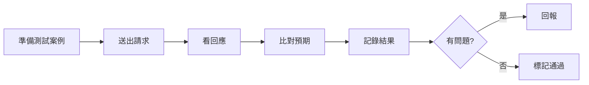
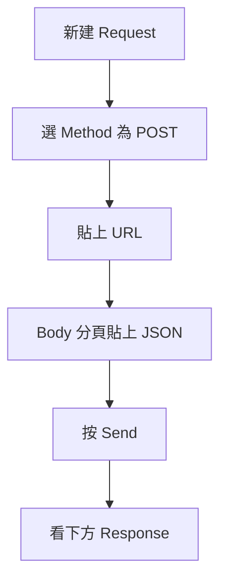
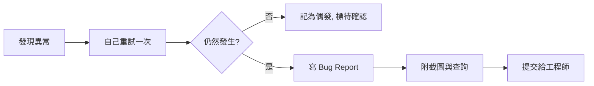

# 測試執行實務

---

## 📋 概述

前幾章你已經理解了產品在做什麼、MDFO 查詢長什麼樣子。這一章開始「動手」——把一個查詢真的送出去，看回應對不對，並把結果記下來、把問題報出去。

這一章不需要你會寫程式。你要學的是三種「送出請求、看回應」的方式，以及把觀察到的東西整理成別人看得懂的紀錄：



- **送出請求**的三種方式：Postman（圖形介面，最好上手）、瀏覽器開發者工具（觀察前端實際送了什麼）、現成測試腳本（一次跑很多案例）。
- **前端 UI 測試（手動）**：打開網頁像使用者一樣操作，驗證畫面顯示的結果對不對。
- **記錄結果**：用 Excel / Google Sheets 建一張表，欄位固定。
- **回報問題**：發現不對時，寫成一份別人能重現的 Bug Report。

---

## 核心概念

### 什麼是「一個請求」

Smart Insight Engine 是一個 API。你可以把它想成一個「問答窗口」：你遞進去一段 JSON（你的問題，也就是 MDFO 查詢），它回你一段 JSON（答案，也就是數字或列表）。

| 名詞 | 白話 |
|------|------|
| Request（請求） | 你遞進去的問題 |
| Endpoint / URL | 窗口的地址，決定送去哪裡 |
| Method | 動作類型，查詢通常是 `POST` |
| Body | 請求的內容，這裡就是 MDFO 查詢的 JSON |
| Response（回應） | 窗口回給你的答案 |
| Status Code | 一個數字，告訴你這次是成功還是出錯 |

### Status Code 快速判讀

| 數字 | 意思 | 你該做什麼 |
|------|------|-----------|
| `200` | 成功 | 檢查回應內容對不對 |
| `400` | 你的請求有問題（例如 JSON 打錯） | 檢查 Body 格式 |
| `401` / `403` | 沒權限 | 確認金鑰 / 登入 |
| `404` | 地址錯了 | 檢查 URL |
| `500` | 伺服器自己出錯 | 記下來、回報給工程師 |

---

## 實務步驟

### 一、Postman：送出一個 API 請求

Postman 是圖形介面工具，比命令列友善很多。基本流程只有五步：



1. **新建 Request**：左上角 `New` → `HTTP Request`，或按 `+` 開新分頁。
2. **選 Method**：URL 左邊的下拉選單，查詢請求選 `POST`。
3. **貼上 URL**：把工程師給你的查詢網址貼進中間的網址欄（例如 `https://<你的環境>/api/query`）。
4. **貼上 Body**：點網址下方的 `Body` 分頁 → 選 `raw` → 右側格式選 `JSON` → 把 MDFO 查詢貼進來。例如：

   ```json
   {
     "measure": "product_count",
     "dimensions": ["Brand"],
     "filters": { "any": { "SupplementFact": ["Vitamin C"] }, "all": {} },
     "options": { "limit": 10 }
   }
   ```

5. **按 Send**：右側藍色 `Send` 按鈕。下方會出現 Response，包含：
   - **Status Code**（右上角，例如 `200 OK`）
   - **回應內容**（下方的 JSON，就是查詢結果）
   - **Time**（花了多久）

> 小技巧：如果需要金鑰，通常放在 `Headers` 分頁（例如 `Authorization`）。這些設定第一次由工程師幫你設好，之後可存成 Collection 重複使用。

### 二、瀏覽器開發者工具：看前端實際送了什麼

當你在網頁上點一個按鈕、畫面卻顯示錯誤時，你會想知道「前端到底送了什麼給後端」。開發者工具就是拿來看這個的。

1. 在頁面上按 `F12`（Mac 為 `Cmd+Option+I`），開啟開發者工具。
2. 切到 **Network（網路）** 分頁。
3. **重新操作一次**（例如再點一次那個按鈕）——這時 Network 會列出這次操作發出的所有請求。
4. 找到你要看的那筆請求（通常名稱含 `query` 或 `api`），點它，右側會分頁顯示：

| 分頁 | 你能看到 |
|------|---------|
| **Headers** | 這筆請求的 URL 與 Status Code |
| **Payload** / Request | 前端送出去的 MDFO 查詢內容 |
| **Preview** / **Response** | 後端回來的答案 |

這一步的價值：當畫面顯示的數字很奇怪，你可以在這裡確認「是前端送錯查詢，還是後端回錯答案」——這對寫 Bug Report 非常有用。

### 三、執行現成測試腳本

有時你要一次驗證很多個案例，一個一個貼 Postman 太慢。工程師準備了現成腳本 `quick_test.py`（**位於產品 repo**），你只要「執行」並「讀輸出」，不需要懂 Python。

> 如果你從未用過終端機（那個輸入文字指令的視窗），先讀 [general/02_unix-linux-basics.md](../../general/02_unix-linux-basics.md) 建立基本操作；第一次執行建議由工程師帶著跑一遍。

在產品 repo 目錄下，於終端機輸入：

```bash
python quick_test.py
```

輸出大致長這樣，你只要會判讀最後的摘要：

```
✅ Test 1/5: Basic count - no filters        (measure_value = 12,345)
✅ Test 2/5: Count by Brand
❌ Test 3/5: Count with Vitamin C filter
   Expected: > 0    Actual: 0
========================================
Summary: 4/5 passed
```

- ✅ 代表通過，❌ 代表失敗。
- 失敗的那行會列出 **Expected（預期）** 與 **Actual（實際）**，這就是你要記錄與回報的重點。
- 你的工作不是修腳本，而是把「哪一個案例失敗、預期與實際差在哪」抄進紀錄表。

> 其它可能出現的腳本（如 `tests/` 目錄下的檔案）都**位於產品 repo**，用法一律「執行 → 讀摘要」，遇到不確定的參數就問工程師。

### 四、前端 UI 測試（手動）

Postman 測的是「引擎答得對不對」；這一節測的是「**使用者看到的畫面對不對**」。引擎答對了，畫面仍可能畫錯——圖表少一塊、數字對不上、錯誤訊息看不懂，這些只有實際打開網頁才會發現。

做法不需要任何新工具，就是**眼睛＋滑鼠**：

1. **先想好預期**：打開頁面前，先想「這個操作之後，畫面應該長怎樣」（呼應 02 章：先有預期，才能比對）。
2. **像使用者一樣操作**：實際點選、輸入、送出查詢。
3. **對照預期觀察**，重點看四件事：

| 檢查項 | 看什麼 | 異常的樣子 |
|--------|--------|-----------|
| **UI 顯示** | 版面、圖表有沒有正常畫出來 | 版面破圖、圖表空白、文字溢出 |
| **資料載入** | 讀取狀態會不會結束 | 一直轉圈、結果區永遠空白 |
| **數字合理性** | 畫面上的數字量級對嗎 | 明顯偏大或偏小（判斷心法見第 06 章） |
| **錯誤訊息** | 故意做一次會失敗的操作 | 錯誤提示不是人話、把技術錯誤原文丟給使用者 |

4. **畫面怪的時候**：用本章第二節的開發者工具（F12 → Network）分辨「是前端送錯查詢，還是後端回錯答案」，把判斷連同截圖寫進 Bug Report。

測試結果一樣記進下一節的紀錄表，問題照回報流程處理。

> 邊界說明：UI 測試也可以自動化（工程師會用 Playwright 這類工具寫成程式自動點擊），那是工程師的事。你的職責是手動驗證畫面，以及發現自動化測不到的「看起來不對勁」。

### 五、用試算表記錄測試結果

每做一次測試，就在 Excel / Google Sheets 記一列。建議固定這些欄位：

| 欄位 | 說明 | 範例 |
|------|------|------|
| 案例編號 | 對應測試案例 | TC-013 |
| 日期 | 執行日期 | 2026-07-05 |
| 輸入 | 這次的查詢（MDFO 摘要即可） | product_count / Brand / Vitamin C |
| 預期 | 你認為應該得到什麼 | 回傳 10 個品牌，數字皆 > 0 |
| 實際 | 真的得到什麼 | 只回 3 個品牌 |
| 狀態 | 通過 / 失敗 / 待確認 | 失敗 |
| 備註 | 補充觀察 | 疑似 filter 沒生效 |
| 截圖連結 | 證據 | （貼圖片網址） |

原則：**輸入、預期、實際**這三欄一定要填，因為它們是判斷與回報的依據。狀態欄用固定字詞（通過 / 失敗 / 待確認），方便日後篩選統計。

### 六、問題回報流程

發現失敗、且確認不是自己操作錯之後，就寫一份 Bug Report。目標只有一個：**讓別人能照著重現這個問題**。



一份好的 Bug Report 包含：

1. **標題**：一句話講清楚問題（例：「Vitamin C 品牌查詢回傳 0 筆，預期應有結果」）。
2. **重現步驟**：1、2、3 條列，讓對方照做就能重現。
3. **預期結果**：應該發生什麼。
4. **實際結果**：實際發生什麼。
5. **證據**：截圖、以及你送出的那段 MDFO 查詢 JSON。
6. **影響範圍**（可選）：只影響這個查詢，還是一整類都這樣。

---

## ❓ 常見問題 FAQ

**Q：我完全沒寫過程式，能執行測試腳本嗎？**
A：能。你只需要在正確的目錄打一行 `python quick_test.py`，然後看最後的通過 / 失敗摘要。腳本本身**位於產品 repo**，已經寫好，你不需要讀懂裡面的 Python。

**Q：Postman 和瀏覽器開發者工具差在哪？我該用哪個？**
A：Postman 是你「主動」構造一個請求去測 API；開發者工具是「觀察」網頁前端實際送了什麼。驗證 API 本身用 Postman；追查「畫面怎麼跟預期不一樣」用開發者工具。

**Q：Status Code 是 200，但數字看起來不對，算通過嗎？**
A：不算。200 只代表「請求成功送達並得到回應」，不代表「答案正確」。內容對不對要靠你比對預期，那屬於下一章的資料驗證。

**Q：測試失敗時，我要自己去找原因嗎？**
A：不用深挖。你的責任是「清楚描述問題 + 附上證據」。找根因是工程師的工作，但你附的資訊越完整（查詢 JSON、截圖、Expected/Actual），他們越快能修。

**Q：前端測試時，我需要評價介面好不好看嗎？**
A：不用。你測的是「畫面顯示的資料**對不對**」，不是「介面設計**好不好用**」——後者是設計師與 PM 的領域。但如果某個設計明顯阻礙你完成操作，當一般問題回報即可。

**Q：記錄表一定要用 Excel 嗎？**
A：不一定，Google Sheets 也可以，重點是欄位固定、狀態欄用一致字詞。格式不是重點，能篩選、能回溯才是重點。

---

## 🔗 相關文檔

- [00_outline.md](./00_outline.md) - Testing 角色學習大綱
- [06_test-result-analysis.md](./06_test-result-analysis.md) - 下一章：測試結果分析
- [../../projects/prismavision/smart-insight-engine/03_test-case-design.md](../../projects/prismavision/smart-insight-engine/03_test-case-design.md) - 測試案例設計（進階，方法論參考）
- [../../projects/prismavision/smart-insight-engine/00_overview.md](../../projects/prismavision/smart-insight-engine/00_overview.md) - 產品總覽

---

## 📝 版本歷史

| 版本 | 日期 | 作者 | 變更說明 |
|------|------|------|----------|
| 1.0 | 2026-07-05 | maple | 初版建立 |
| 1.1 | 2026-07-07 | maple | 新增「前端 UI 測試（手動）」節（通用檢查法，不綁特定頁面）；執行腳本節補終端機入門連結 |

---

**文檔結束**
