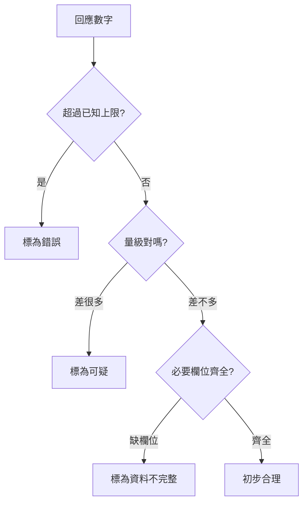
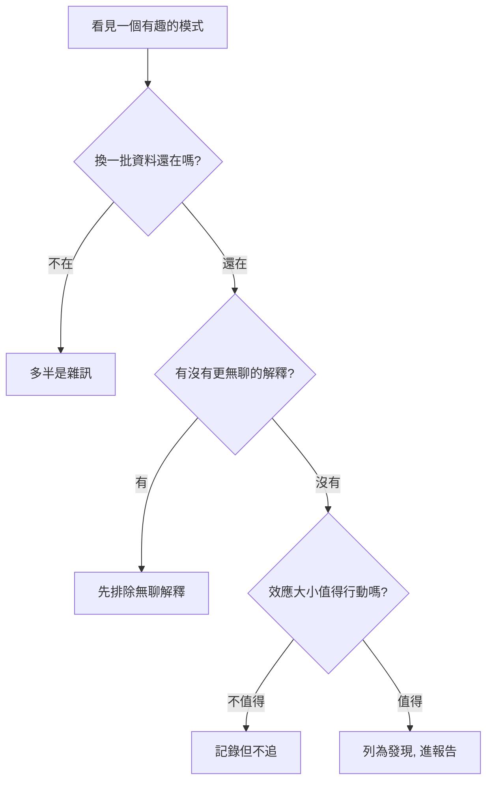
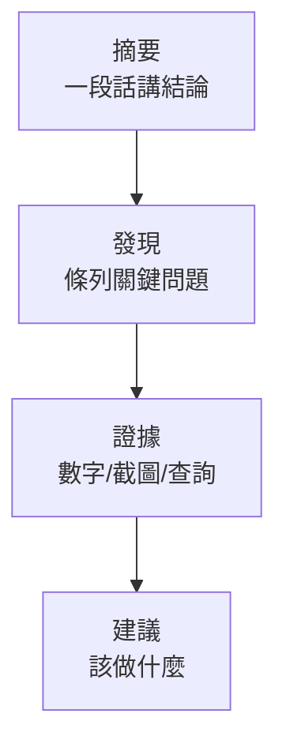

# 測試結果分析

---

## 📋 概述

上一章你學會把查詢送出去、看到回應。這一章要回答一個更難的問題：**這個回應「對不對」、「合不合理」，以及它在講什麼故事。**

Status Code 是 200 不代表答案正確。一個數字可能格式完全正常，卻在商業上完全不合理。這一章教你四件事：

- **驗證**：這個數字有沒有可能是對的？
- **分類異常察覺**：分組的名稱與階層看起來正常嗎？
- **解讀**：如果是對的，它對業務意味著什麼？
- **異常識別**：看到一個「有趣的模式」時，怎麼判斷它是真信號還是假象。

---

## 核心概念

### 「合理」不是「精確」

你多半沒辦法知道正確答案是「12,345 還是 12,346」。但你幾乎總能判斷「12,345 合理，而 3 或 990,000 不合理」。測試的第一道防線是**量級判斷**，不是精確比對。

### 三種驗證角度

| 角度 | 你在問什麼 | 例子 |
|------|-----------|------|
| **對照已知總數** | 這個數字有沒有超過它不可能超過的上限 | 某品牌產品數 > 全站總數 → 一定錯 |
| **量級判斷** | 這個數字的位數對不對 | 全站約 13 萬筆，某查詢回 900 萬 → 可疑 |
| **必要欄位齊全** | 該有的欄位有沒有缺 | 分組查詢卻沒有分組名稱 → 資料不完整 |

---

## 實務步驟

### 一、資料驗證：判斷數字是否合理

拿到一個回應，依序問三個問題：

1. **對照已知總數**：我們的資料集約 13 萬筆、13 個維度。任何「部分」都不該大於「全部」。一個品牌的產品數不可能大於全站產品數；某成分的產品數不可能超過含該成分的總數。
2. **量級判斷**：看位數，不看尾數。預期是「幾百」卻回「幾十萬」，或預期「幾千」卻回「個位數」，先當可疑。
3. **必要欄位齊全**：分組（Dimensions）查詢的每一列，都該有分組名稱和對應數值；如果某列的分組名稱是空的、或該有的 measure 值缺了，就是資料不完整，要記下來。

> 記住：MDFO 查詢的結構決定了回應該長什麼樣。用 Dimensions 分組，就該回多列且每列有分組名；沒有 Dimensions，就該回單一數值。回應形狀跟查詢對不上，本身就是一種異常。

### 二、分類異常察覺：分組名稱與階層合理嗎

產品的維度大多是**有階層的分類法（Taxonomy）**：例如 SupplementFact（營養成分）底下分維生素類、礦物質類，維生素類底下才是 Vitamin C。查「維生素類」時，所有子分類的產品都應該被算進來。

先講清楚分工：**系統性驗證整棵分類樹**（掃出重複節點、階層錯誤、遺漏的分類）**是資料團隊的工作**，他們直接檢查資料庫，你不需要做這件事。你的角色是在日常測試中**察覺分類相關的異常，記下來、回報**。有兩個訊號特別值得留意：

| 訊號 | 怎麼發現 | 為什麼重要 |
|------|---------|-----------|
| **父子倒掛** | 子分類的產品數大於它的父分類（Vitamin C 有 5,000 筆，維生素類全體卻只有 3,000 筆） | 一定有錯——可能是資料錯，也可能是**引擎計算階層時沒把子分類算進父分類**。後者查資料庫看不到（資料可能完全正確），只有查詢結果層會現形，正是測試角色的守備範圍 |
| **雙胞胎分組** | 分組結果掃一眼，有沒有兩列名稱幾乎一樣（Vitamin C / vitamin C / Vitamin-C），數量卻各自不小 | 同一群產品被拆成兩列，統計已經失真 |

此外，若業務常識明顯被違反——例如查劑型分布，結果裡竟然沒有「膠囊」——同樣當異常記錄並回報。你不需要主動去掃「有沒有分類被遺漏」（那是資料團隊的系統性檢查），只要在結果明顯不對勁時別放過它。

### 三、結果解讀：從數字到商業意義

驗證通過後，把數字讀成業務語言。三種最常見的回應各有讀法：

| 回應類型 | 數字 | 商業解讀 |
|---------|------|---------|
| **count（計數）** | 某品牌 87 筆產品 | 品牌在該類別的「鋪貨廣度」 |
| **平均值** | Vitamin C 產品均價 $18 | 這個品類的「價格帶位置」 |
| **分布** | 劑型：錠劑 60%、膠囊 30%、粉 10% | 消費者/市場的「形態偏好」 |

解讀時的兩個提醒：

- **平均值會被極端值拉走**。少數天價產品會把均價抬高，看到「均價偏高」時，順手想一想是不是被幾筆離群值帶動的。
- **比例要看基數**。「某成分佔 80%」聽起來很強，但如果總數只有 5 筆，這個 80% 幾乎沒有意義。

### 四、異常識別：這個模式是真的嗎

你很快就會開始在資料裡「看見趨勢」。這是好事，也是陷阱——資料一多，假的模式**必然**會出現，而人腦天生會替任何模式編故事。看到一個有趣的模式，先過三道關（呼應 [emergence-data-compute.md](../../general/emergence-data-compute.md) 第 6 節）：

1. **換一批資料還在嗎？** 只在這一批資料裡成立的模式，多半是巧合。換個時間範圍、換個子集，若模式消失，就別當真。
2. **有沒有更無聊的解釋？** 在下結論「發現新趨勢」之前，先排除這些平淡的可能：
   - **抽樣偏差**：這批資料本身就偏了（例如只抓了某平台、某時段）。
   - **欄位定義變更**：某個欄位的計算口徑改了，數字跳動只是定義變了，不是市場變了。
   - **爬蟲行為改變**：資料來源那端的採集方式變了，量的變化來自採集，不是真實世界。
3. **效應大小值得行動嗎？** 「統計上有差異」不等於「商業上重要」。差 2% 就算真實，也可能不值得任何人為它改變決策。

> 這正是產品內建 **TheArgus**（異常檢測）存在的理由：它是系統的免疫系統，專門攔下「看起來像洞察、其實是資料品質問題」的假湧現。你做人工分析時，等於是在替它做同一件事。

### 五、測試報告撰寫

把驗證和分析的結果寫成報告。結構建議由上而下四層，讓讀者三十秒抓到重點、需要細節時再往下看：

| 段落 | 寫什麼 | 原則 |
|------|--------|------|
| **摘要** | 一段話：測了什麼、整體狀況、最重要的一個結論 | 讓忙的人只讀這段就夠 |
| **發現** | 條列問題，每條一句話 | 一條講一件事，別混在一起 |
| **證據** | 每個發現附數字、截圖、送出的 MDFO 查詢 | 沒有證據的發現不算數 |
| **建議** | 針對發現，建議下一步 | 具體、可執行 |

撰寫重點：**清楚描述問題 + 附上證據**。與其寫「數字怪怪的」，不如寫「Vitamin C 品牌查詢回傳 0 筆，但 Postman 直接查同一 filter 有 372 筆（附截圖與查詢 JSON），疑似前端 filter 未生效」。後者讓工程師能立刻動手。

---

## ❓ 常見問題 FAQ

**Q：我不知道正確答案是多少，怎麼判斷對不對？**
A：你不需要知道精確答案。用量級判斷和對照已知總數就能抓到大部分錯誤——「部分大於全部」「位數差一截」這類錯，不需要標準答案也看得出來。

**Q：我發現了一個很有趣的趨勢，可以直接寫進報告當發現嗎？**
A：先過三道關：換一批資料還在嗎、有沒有更無聊的解釋（抽樣偏差 / 欄位定義變更 / 爬蟲行為改變）、效應大小值得行動嗎。三關都過了再寫成發現，否則只記錄、不下結論。

**Q：平均值看起來很高，是不是就代表這個品類貴？**
A：不一定。平均值容易被少數極端高價產品拉高。看到均價偏高時，想一想是不是被幾筆離群值帶動的，必要時改看分布或中位數會更誠實。

**Q：報告一定要很長很正式嗎？**
A：不用。格式不是重點，內容清楚才是。一段摘要 + 幾條有證據的發現 + 建議，就是一份好報告。重點是別人讀完知道發生什麼、能重現、知道下一步。

**Q：分類法驗證是我的責任嗎？我要背整棵分類樹嗎？**
A：都不用。系統性驗證分類樹（掃重複、階層錯誤、遺漏）是資料團隊直接對資料庫做的事。你只要在測試中留意兩個訊號——父子倒掛、雙胞胎分組——看到就記錄回報。分類樹也不用背，業務常識夠用了。

**Q：驗證是我的責任，還是工程師的？**
A：合理性的第一道防線是你。你在最前線看到回應，能最早發現「這數字不對勁」。把可疑處連同證據標出來，交給工程師深挖根因。

---

## 🔗 相關文檔

- [05_test-execution-practice.md](./05_test-execution-practice.md) - 上一章：測試執行實務
- [00_outline.md](./00_outline.md) - Testing 角色學習大綱
- [../../general/emergence-data-compute.md](../../general/emergence-data-compute.md) - 湧現與「湧現不保證是真的」三個檢驗問題
- [../../projects/prismavision/smart-insight-engine/03_test-case-design.md](../../projects/prismavision/smart-insight-engine/03_test-case-design.md) - 測試案例設計（進階參考）

---

## 📝 版本歷史

| 版本 | 日期 | 作者 | 變更說明 |
|------|------|------|----------|
| 1.0 | 2026-07-05 | maple | 初版建立 |
| 1.1 | 2026-07-07 | leana | 新增「分類異常察覺」節（父子倒掛、雙胞胎分組，明確與資料團隊的分工邊界） |

---

**文檔結束**
