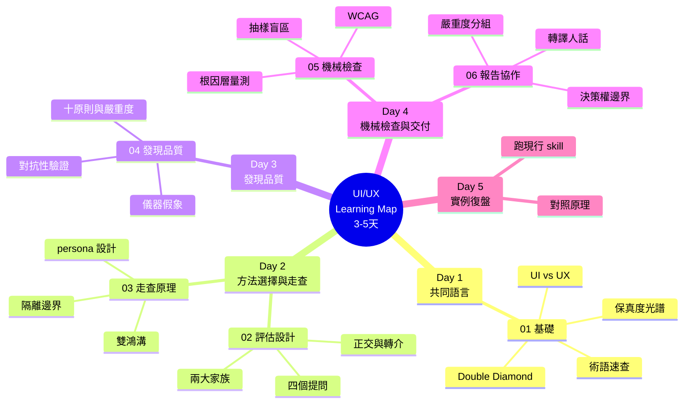

# UI/UX Learning Map - 評估素養學習大綱

---

## 設計原則

- **素養導向**: 全團隊可讀——教「怎麼評、為什麼這樣評」，不教設計工具操作
- **跨產品通用**: 不綁任何產品；團隊現行 skills 只作為「原理的現行實作」實例
- **理論接文獻**: 每個評估原則標注 HCI／認知科學出處，只引已核對的經典
- **理論放承重章**: 基礎章只建立詞彙，理論出現在真正使用它的章節

---

## 學習路徑概覽

### 📚 完整學習地圖 (01-06) - 總共 3-5 天
**目標**：能為產品選對評估方法、看懂並審核評估報告、理解每個協議規定背後的原理

- 01：共同語言（0.5-1 天）
- 02：方法選擇（0.5 天）
- 03-04：走查原理與發現品質（1-1.5 天）
- 05-06：機械檢查與報告協作（1 天）
- Day 5：實例復盤（選修，需產品 repo 權限）

> **📌 主題檔**：
> 1. [01_uiux-fundamentals.md](./01_uiux-fundamentals.md) - UI/UX 基礎：團隊共同語言
> 2. [02_evaluation-design.md](./02_evaluation-design.md) - 評估方法設計：問題決定方法
> 3. [03_walkthrough-principles.md](./03_walkthrough-principles.md) - 走查的設計原理
> 4. [04_finding-quality.md](./04_finding-quality.md) - 發現的品質
> 5. [05_mechanical-checks.md](./05_mechanical-checks.md) - 機械檢查的設計
> 6. [06_reporting-collaboration.md](./06_reporting-collaboration.md) - 報告與協作
>
> **實例（現行實作參考）**：cognitive-walkthrough、stickiness-walkthrough、
> responsive-snapshot、responsive-review、ui-audit 五個評估 skill，
> **位於產品 repo（需另行取得存取權限）**。教材教原理，協議細節以 skill 檔為準。

### 🗺️ UI/UX 學習地圖

---

## 📋 完整大綱

### **01_uiux-fundamentals.md - UI/UX 基礎**
> 學習階段：Day 1 | 深度：素養建立

- **UI vs UX** - 「看起來如何」vs「用起來如何」；UI 好看 ≠ UX 好
- **設計流程** - Double Diamond 四階段與各階段產出物
- **術語速查** - persona / journey / affordance / design system 各一句話＋指路
- **保真度光譜** - wireframe → mockup → prototype：在最便宜的階段發現最多問題

### **02_evaluation-design.md - 評估方法設計**
> 學習階段：Day 2 | 深度：方法選擇

- **四個正交提問** - 首次摩擦／回訪價值／版面契約／客觀品質
- **兩大家族** - 主觀走查（需要判斷）vs 機械檢查（有客觀標準）；能客觀化的先客觀化
- **正交與轉介** - 方法有守備範圍，越界判定兩頭做壞

### **03_walkthrough-principles.md - 走查的設計原理**
> 學習階段：Day 2-3 | 深度：方法原理

- **理論地基** - Norman 雙鴻溝：「預期 vs 實際」量的就是它
- **認知走查源流與團隊變體** - 經典：沿任務序列問固定問題；變體：自由摸索、只記第一次猜測
- **persona 設計** - 人設跟著提問走：天真＋有目標 vs 回訪＋帶鉤子
- **隔離邊界跟著測量走** - 知識的詛咒：評估者不能「假裝第一次」
- **評估者數量** - 五使用者曲線；多評估者撞到＝信心加權
- **兩訪協議** - 深連結 vs 真冷啟；回訪軸從「可觀察的回訪訊號」推導
- **代理訊號邊界** - agent 量的是代理訊號，不是真 retention

### **04_finding-quality.md - 發現的品質**
> 學習階段：Day 3 | 深度：品質工程

- **假發現來源** - 儀器假象（過期資料／替身資料／殘留狀態／時序競態）與判斷錯誤（evaluator effect）
- **兩道防線** - 環境完整性（判定前）＋對抗性驗證（判定後）
- **驗證方向** - 宣稱「有問題」防假陽性；宣稱「缺東西」防 false-missing
- **判定框架** - Nielsen 十原則＋嚴重度 0-4
- **聚類收斂** - 按根因不按表象；也記「確認良好」；候選給人看，不是定論

### **05_mechanical-checks.md - 機械檢查的設計**
> 學習階段：Day 4 | 深度：方法原理

- **標準來源** - WCAG 2.1：對比 4.5:1、Reflow 400% 縮放（等效 320 CSS px）
- **根因層量測** - 對比在 runtime、一致性掃原始碼（計算值銷毀根因資訊）
- **決定論矩陣** - viewport × route × theme：可重現才可比較
- **抽樣盲區** - 離散樣本 vs 連續契約；連續掃描＋數值量測補盲

### **06_reporting-collaboration.md - 報告與協作**
> 學習階段：Day 4 | 深度：交付實務

- **報告結構** - 嚴重度分組、證據具體性、pass/fail 矩陣
- **轉譯** - 現象講人話、證據留術語
- **決策權邊界** - 報告提方向，修不修使用者拍板
- **協作介面** - 評估發現 vs 測試 bug 的分界與轉介

---

## 學習階段規劃

### Day 1：共同語言
- 分清 UI 與 UX、認識設計流程與產出物、建立術語詞彙

### Day 2：方法選擇與走查源流
- 四個提問與兩大家族、轉介紀律
- 雙鴻溝、認知走查協議、persona 設計

### Day 3：隔離與發現品質
- 知識的詛咒與隔離邊界、兩訪協議、代理訊號
- 儀器假象、對抗性驗證、十原則與嚴重度

### Day 4：機械檢查與交付
- WCAG、根因層量測、抽樣盲區
- 報告結構、轉譯、協作介面

### Day 5：實例復盤（選修）
- 取得產品 repo 權限，實際跑一次現行評估 skill
- 對照教材：每個協議規定對應哪條原理

---

## 能力驗證標準

### 基礎能力（完成 3-5 天學習）
- ✅ 能分辨四個提問各用什麼方法、說出為什麼不能混
- ✅ 能說出「為什麼評估者不能假裝第一次」（知識的詛咒）
- ✅ 能舉出兩種以上的儀器假象
- ✅ 能解釋為什麼對比在 runtime 量、一致性掃原始碼
- ✅ 能看懂一份評估報告並指出證據不足的發現
- ✅ 能判斷一個問題該走評估報告還是 bug 追蹤

### 進階能力（透過實際專案學習）
- 🔄 能為新產品設計一輪評估組合（選方法、設 persona、定驗收條款）
- 🔄 能審核走查報告的發現品質（該防假陽性還是 false-missing）
- 🔄 能主持評估發現的分流與決策討論

---

## 理論出處總表

| 理論 | 出處 | 所在章 |
|------|------|--------|
| Double Diamond | Design Council, 2005 | 01 |
| 雙鴻溝／心智模型 | Norman, *The Design of Everyday Things*, 1988 | 03 |
| 認知走查 | Lewis, Polson, Wharton & Rieman, CHI '90; Wharton et al., 1994 | 03 |
| persona | Cooper, 1999 | 03 |
| 知識的詛咒 | Camerer, Loewenstein & Weber, 1989 | 03 |
| 五使用者曲線 | Nielsen & Landauer, 1993 | 03 |
| Hook Model（背景閱讀——非回訪軸的來源，見 03 §6） | Eyal, 2014 | 03 |
| HEART 框架（背景閱讀——非回訪軸的來源，見 03 §6） | Rodden, Hutchinson & Fu, CHI 2010 | 03 |
| construct validity | 測量理論 | 03 |
| 啟發式評估／十原則 | Nielsen & Molich, CHI '90; Nielsen, 1994 | 04 |
| 嚴重度 0-4 量表 | Nielsen | 04 |
| evaluator effect | Hertzum & Jacobsen, 2001 | 04 |
| 可證偽性 | Popper | 04 |
| WCAG 2.1（1.4.3 / 1.4.10） | W3C | 05 |
| Gestalt 完形原則 | Wertheimer | 05 |
| 邊界值分析 | 軟體測試學 | 05 |

---

## 與其他學習路徑的互鏈

| 本路徑 | 連到 | 關係 |
|--------|------|------|
| 03 隔離邊界 | [general/compute-state-context.md](../../general/compute-state-context.md) | context 即狀態——隔離的機制基礎 |
| 04 發現品質 | [general/emergence-data-compute.md](../../general/emergence-data-compute.md)、[testing/06](../testing/06_test-result-analysis.md) | 假湧現三道關——同思想家族 |
| 05 抽樣盲區 | [general/isomorphism-projection.md](../../general/isomorphism-projection.md) | 投影必有 null space——盲區的數學骨架 |
| 06 協作介面 | [testing/05](../testing/05_test-execution-practice.md) | Bug Report 規範——分工的另一端 |

---

## 常見問題

### Q: 我不是設計師，這條路徑跟我有關嗎？
A: 有。這是素養教材：PM 要能讀懂評估報告做取捨、工程要理解發現背後的原理、測試要分得清「bug 還是設計如此」。設計者則把它當方法學譜系的複習。

### Q: 會教 Figma 或畫 UI 嗎？
A: 不會。這條路徑教「評估」不教「創作」；設計工具的操作不在範圍內。

### Q: 一定要會用 Claude Code 才能學嗎？
A: 讀概念不用。只有 Day 5 選修的實例復盤需要（前置：[general/claude-code-tips.md](../../general/claude-code-tips.md)＋產品 repo 權限）。

### Q: 教材跟現行 skills 不一致時聽誰的？
A: 執行聽 skill（協議細節會演化），原理聽教材（原理不隨工具變）。若發現原理層面的矛盾，值得回報——可能是 skill 演化了，也可能是教材該更新了。

### Q: 為什麼理論不集中放一章？
A: 理論放在它「承重」的地方才有意義——雙鴻溝在走查章（它是「預期 vs 實際」的地基）、十原則在品質章（它是判定字典）。集中放的理論章讀完就忘。

---

**版本歷史**

| 版本 | 日期 | 變更內容 | 作者 |
|------|------|---------|------|
| 1.0 | 2026-07-07 | 初版建立：01-06 六個主題檔＋大綱，理論接文獻、實例接現行評估 skills | maple |
| 1.1 | 2026-07-07 | 雙 agent review 後修正：WCAG 1.4.10 更正為 400%/320px、Hook/HEART 改註背景閱讀（回訪軸實際由「可觀察回訪訊號」推導）、認知走查署名補全、互鏈措辭對齊 | maple |
