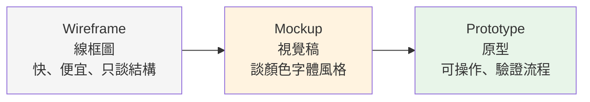

# UI/UX 基礎 - 團隊共同語言

> 學習階段：Day 1 ｜ 深度：素養建立
> 目標讀者：全團隊——不限設計背景

---

## 📋 概述

這一章不教你怎麼做設計，而是建立一套**共同語言**：讓 PM、工程、測試在跟設計討論時，說的是同一件事。本章刻意只建立詞彙——每個概念背後的理論，放在它真正「承重」的章節（例如雙鴻溝在 [03](./03_walkthrough-principles.md)、十原則在 [04](./04_finding-quality.md)），讀到那裡自然會遇到。

讀完本章後，你能：

- 分清 UI 與 UX（最常被混用的一對詞）
- 說出設計流程的四個階段與各自的產出物
- 看懂 persona、user journey、wireframe 這些詞在會議中指什麼

---

## 🧭 核心概念

### 1. UI vs UX：不是同一件事

| | UI（使用者介面） | UX（使用者體驗） |
|--|------------------|------------------|
| 關心什麼 | 畫面長什麼樣：排版、顏色、字體、元件 | 用起來什麼感覺：找不找得到、順不順、想不想再來 |
| 一句話 | 「看起來如何」 | 「用起來如何」 |
| 壞掉的樣子 | 破版、對比不足、風格不一 | 找不到入口、流程卡住、用完就不回來 |

**最重要的認知：UI 好看不等於 UX 好。** 一個按鈕可以設計得很漂亮，但如果使用者根本找不到它、或按了之後不知道發生什麼事，體驗仍然是壞的。反過來，一個樸素的介面也可能因為流程順暢而體驗極佳。

這個區分直接對應後面的評估方法：**UI 的問題多半有客觀標準可量**（對比度、破版——見 [05](./05_mechanical-checks.md)）；**UX 的問題需要走查與判斷**（直不直覺、想不想回來——見 [03](./03_walkthrough-principles.md)）。

### 2. 設計流程：Double Diamond

英國 Design Council（2005）提出的 **Double Diamond** 是最廣為使用的設計流程模型——兩顆菱形，各代表一次「先發散、再收斂」：

| 階段 | 在做什麼 | 常見產出物 |
|------|---------|-----------|
| **Discover** | 廣泛理解使用者與問題，不急著解 | 訪談紀錄、觀察筆記 |
| **Define** | 把發現收斂成「要解的那個問題」 | persona、user journey、問題定義 |
| **Develop** | 廣泛嘗試多種解法 | wireframe、mockup、prototype |
| **Deliver** | 驗證、修正、交付 | 可用性評估報告、最終設計、handoff 規格 |

兩個常見誤區：**跳過第一顆菱形**（沒搞清楚問題就開始畫畫面），以及**只發散不收斂**（方案越提越多、永遠定不了案）。

### 3. 關鍵術語速查表

以下每個詞給最小定義；理論與深入用法在標注的章節。

| 術語 | 一句話定義 | 深入 |
|------|-----------|------|
| **persona** | 一個虛構但具體的代表性使用者：她是誰、想完成什麼 | [03](./03_walkthrough-principles.md) |
| **user journey** | 使用者為了完成目標，從頭到尾經過的步驟與每步的感受 | —（本路徑聚焦評估，不展開旅程設計） |
| **affordance** | 一個東西「看起來就知道怎麼用」的程度——按鈕要長得像可以按 | [03](./03_walkthrough-principles.md) |
| **wireframe** | 低保真的版面骨架：只有框和字，不談顏色美感 | 本章下節 |
| **mockup** | 高保真的靜態畫面：長得像成品，但不能操作 | 本章下節 |
| **prototype** | 可以點擊操作的模擬品：用來在寫程式前驗證流程 | 本章下節 |
| **design system** | 一套可重用的元件與規則（顏色、字級、間距），讓產品長得一致 | [05](./05_mechanical-checks.md) |
| **usability（可用性）** | 使用者能否有效、有效率、滿意地完成目標 | [02](./02_evaluation-design.md)–[04](./04_finding-quality.md) |

### 4. 保真度光譜：wireframe → mockup → prototype

三個詞常被混用，其實是同一條「保真度」（fidelity，像不像成品）光譜上的三個點：

**為什麼要分層？成本。** 改一張 wireframe 是幾分鐘的事，改寫好的程式是幾天的事。保真度光譜的存在理由就是：**在最便宜的階段發現最多問題**。討論結構問題用 wireframe 就夠，不需要等到高保真才給意見——那時候能改的已經不多了。

---

## ❓ 常見問題 FAQ

**Q1：我不是設計師，為什麼要讀這章？**
因為設計決策影響每個角色：PM 排需求要看懂 journey、工程要照 handoff 實作、測試要判斷「這是 bug 還是設計如此」。共同語言讓這些討論不用每次從名詞解釋開始。

**Q2：UI 做得漂亮，UX 就會好嗎？**
不會，兩者獨立。漂亮但找不到入口＝UI 好 UX 壞；樸素但流程順＝UI 普通 UX 好。評估時也是分開量的（見 [02](./02_evaluation-design.md)）。

**Q3：需要學 Figma 這類設計工具嗎？**
不需要。本學習路徑教的是「怎麼評估、為什麼這樣評」，不教設計工具操作。看得懂設計產出即可。

**Q4：wireframe 給我看的時候，該回饋什麼？**
回饋結構與流程（「這個入口找得到嗎」「這步是不是多餘」），不要回饋顏色美感——那是 mockup 階段的事。在錯的保真度給回饋，是最常見的協作浪費。

**Q5：這章的理論怎麼這麼少？**
刻意的。理論放在它「承重」的章節：雙鴻溝在 03（走查的地基）、十原則在 04（判定的框架）。這裡只建立詞彙，讀到用它的地方，理論才有意義。

---

## 🔗 相關文檔

- [00_outline.md](./00_outline.md) — UI/UX 角色學習大綱
- [02_evaluation-design.md](./02_evaluation-design.md) — 下一章：評估方法怎麼選

---

## 📝 版本歷史

| 版本 | 日期 | 作者 | 變更說明 |
|------|------|------|----------|
| 1.0 | 2026-07-07 | maple | 初版建立 |
| 1.1 | 2026-07-07 | maple | Review 修正：user journey 指路移除（03 未展開該主題） |
