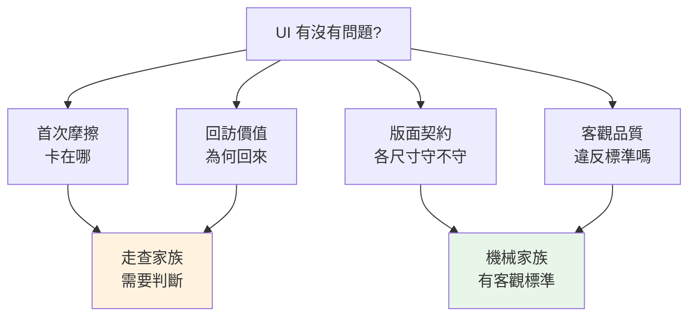

# 評估方法設計 - 問題決定方法

> 學習階段：Day 2 ｜ 深度：方法選擇
> 目標讀者：全團隊

---

## 📋 概述

「幫我看看這個 UI 有沒有問題」——這句話其實藏了好幾個完全不同的問題。這一章的核心命題：**你想回答什麼問題，決定你用什麼方法。** 用錯方法，不是白做，就是做出看起來有理、其實答非所問的結論。

讀完本章後，你能：

- 把「UI 有沒有問題」拆成四個正交的提問
- 分辨哪些問題交給機械量測、哪些必須靠人（或 agent）走查
- 理解為什麼方法之間要「正交、轉介、不越界」

---

## 🧭 核心概念

### 1. 四個正交的提問

同一個產品介面，至少可以問四個互不重疊的問題：

| 提問 | 白話 | 方法家族 |
|------|------|---------|
| **首次摩擦** | 第一次用的人，會在哪裡卡住、看不懂？ | 走查（認知走查） |
| **回訪價值** | 用過一次的人，為什麼要回來？回來接得上嗎？ | 走查（黏著度走查） |
| **版面契約** | 各種螢幕尺寸、縮放比例下，版面守不守承諾？ | 機械檢查（快照矩陣） |
| **客觀品質** | 有沒有違反客觀標準——對比不足、風格雜亂？ | 機械檢查（標準量測） |

**正交**的意思是：任一個問題的答案，推不出另一個問題的答案。首次用起來很順的產品，可能毫無回訪理由；對比全過標準的頁面，可能第一步就讓人迷路。所以四個問題要**分開問、分開答**。

### 2. 兩大家族：主觀走查 vs 機械檢查

| | 主觀走查 | 機械檢查 |
|--|---------|---------|
| 判定依據 | 人（或 agent）的判斷：「這裡我預期 X、實際是 Y」 | 客觀標準：對比 ≥ 4.5:1、無水平捲軸 |
| 結果性質 | 候選發現，需要驗證（見 [04](./04_finding-quality.md)） | 可勾清單，過或不過 |
| 適合的問題 | 直不直覺、想不想回來 | 破版、對比、風格一致性 |
| 成本結構 | 貴（每次都要走一輪） | 便宜（寫一次、跑無限次） |

分工原則：**「壞設計有標準訊號」——能客觀化的先客觀化。** 對比不足、破版這類問題有標準可依，交給機械量測，把「感覺亂」變成可勾的清單；把珍貴的判斷力留給只有判斷能答的問題（直覺、價值感）。

反過來也成立：**不要用機械檢查回答判斷型問題**。「所有對比都過 4.5:1」不能推出「使用者找得到入口」——標準只保證下限，不保證體驗。

> 💡 版面契約其實是**混合型**：截圖擷取是機械的（決定論、可重跑），判讀則是對明文驗收條款的視覺判斷。歸入機械家族，是因為它以條款為判準而非自由心證——擷取與判讀的分離設計見 [05](./05_mechanical-checks.md)。

### 3. 正交與轉介紀律

方法有守備範圍。走查途中撞到對比不足，正確做法不是當場展開判定，而是**標記轉介**（「這是客觀品質問題 → 交給機械檢查」），然後繼續走查自己的問題。

為什麼這麼嚴格？兩個理由：

1. **越界判定會兩頭做壞**——走查者停下來研究對比度，走查的「第一次體驗」節奏就斷了；而口頭估的對比度又不如機械量測準。兩件事都做了半套。
2. **發現要能歸戶**——每類發現有自己的判定框架與嚴重度標準（見 [04](./04_finding-quality.md)）。混在一起的發現清單，後續無法分流處理。

> 💡 這跟醫療分科同一個邏輯：全科醫師發現心臟雜音會轉介心臟科，而不是自己開刀。轉介不是推卸，是讓每個問題進到對的判定框架。

---

## 🔧 我們怎麼做

團隊現行的四個評估 skill（位於產品 repo，需存取權限），正好各守一個提問：

| 提問 | 現行 skill | 一句話 |
|------|-----------|--------|
| 首次摩擦 | `cognitive-walkthrough` | agent 扮第一次使用的 persona 走產品，記「預期 ≠ 實際」 |
| 回訪價值 | `stickiness-walkthrough` | agent 扮回訪使用者走兩訪協議，記回訪價值落差 |
| 版面契約 | `responsive-snapshot` + `responsive-review` | 機械截圖矩陣 → 對驗收條款判讀 |
| 客觀品質 | `ui-audit` | WCAG 對比量測＋風格一致性掃描 |

注意兩個走查 skill 的描述明文寫著「NOT for …（use …）」——轉介紀律的落實：宣告自己不管什麼、該轉給誰。

---

## ❓ 常見問題 FAQ

**Q1：為什麼不做一個「全面體檢」方法，一次查完四個問題？**
因為四個問題的協議互相衝突：首次摩擦要求評估者天真（不能先看過產品），回訪價值卻要求「來過一次」；機械檢查要求環境決定論，走查卻要自由探索。硬合成一個方法，每個問題都只能得到打折的答案。

**Q2：資源有限，先做哪個？**
先機械後走查。機械檢查便宜且能重複跑，先把客觀下限守住；走查貴，留給機械答不了的問題。而且機械檢查掃掉的雜訊（破版、對比）不會再污染走查的發現。

**Q3：走查發現「這裡顏色看不清」，該記嗎？**
記，但標轉介（→ 客觀品質），不要在走查裡展開判定。你的主觀「看不清」是有價值的線索，機械量測會給它客觀的答案。

**Q4：四個提問夠了嗎？會不會有第五個？**
會有。四個是目前的守備範圍，不是完備集（例如「內容寫得好不好懂」就還沒有專屬方法）。重點是原則：新問題出現時，先問「它跟現有提問正交嗎」，正交就開新方法，不要塞進舊方法裡。

---

## 🔗 相關文檔

- [01_uiux-fundamentals.md](./01_uiux-fundamentals.md) — 上一章：共同語言
- [03_walkthrough-principles.md](./03_walkthrough-principles.md) — 下一章：走查家族的設計原理
- [05_mechanical-checks.md](./05_mechanical-checks.md) — 機械家族的設計原理

---

## 📝 版本歷史

| 版本 | 日期 | 作者 | 變更說明 |
|------|------|------|----------|
| 1.0 | 2026-07-07 | maple | 初版建立 |
| 1.1 | 2026-07-07 | maple | Review 修正：「NOT for」描述限縮為走查類 skill、補「版面契約是混合型」註記 |
