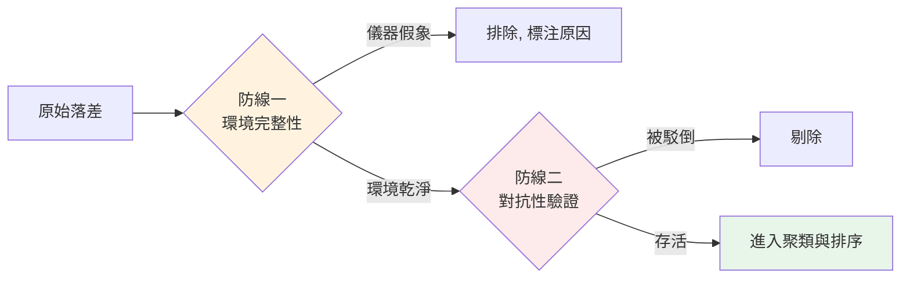

# 發現的品質 - 看起來像洞察，不代表是真的

> 學習階段：Day 3 ｜ 深度：品質工程
> 目標讀者：全團隊（產出或消費評估報告的人）

---

## 📋 概述

走查跑完、清單列出來，最危險的時刻才開始：**每一條發現都看起來很有道理**。但發現可能是假的——不是誰說謊，而是儀器會產生假象、判斷會出錯。這一章教你假發現從哪來、怎麼防，以及一條發現要經過什麼流程才配進報告。

這章跟 [roles/testing/06](../testing/06_test-result-analysis.md) 的「異常識別三道關」、[general/emergence-data-compute.md](../../general/emergence-data-compute.md) 的假湧現檢驗是同一個思想家族：**模式會自己浮現，浮現不保證為真。**

---

## 🧭 核心概念

### 1. 假發現的來源 ①：儀器假象

評估工具（環境、瀏覽器、agent）本身會製造看起來像 UX 問題的假象。常見四類：

| 假象 | 長什麼樣 | 真相 |
|------|---------|------|
| **過期資料** | 「頁面顯示的日期自相矛盾」 | 測試環境的資料是幾個月前的舊包，矛盾來自環境不是產品 |
| **替身資料（mock）** | 「品牌名稱看起來很假」 | 環境沒接上真資料、默默退回假資料——它本來就是假的 |
| **殘留狀態** | 「網站記得我上次的設定，黏著度好棒」 | 上一輪測試殘留的視窗狀態或瀏覽器儲存，不是產品功能 |
| **時序競態** | 「列表是空的！」 | agent 判讀比畫面渲染快——資料在路上，不是不存在 |

共同結構：**儀器的狀態被誤讀成產品的行為。** 這正是為什麼評估協議裡有那些看似囉嗦的規定（判讀前等動畫、宣稱「空」之前先數實際元素、冷啟要真的關掉重開）——每一條都對應一種已經真實發生過的假象。

### 2. 假發現的來源 ②：判斷錯誤

就算儀器乾淨，判斷本身也會錯。HCI 有個令人不安的實證結果——**evaluator effect**（Hertzum & Jacobsen, 2001）：不同評估者評同一個介面，找到的問題**重疊度出乎意料地低**，對嚴重度的判斷也分歧。

這不是「找更認真的評估者」能解決的，它是判斷型評估的結構性質。應對方式不是消滅分歧，而是**把分歧變成訊號**：多個獨立評估者都撞到的點信心高，只有一人報的點標為待驗證。（這正是 [03](./03_walkthrough-principles.md) 多 persona 設計的另一半理由。）

### 3. 兩道防線

**防線一：環境完整性（判定前）**——判定任何發現之前，先確認儀器乾淨：資料是新的嗎？是真資料嗎？狀態是乾淨的嗎？渲染完成了嗎？答不出來的發現，先擱置。

**防線二：對抗性驗證（判定後）**——對每條候選發現，指派一個「反方」努力**駁倒它**：找反例、找更無聊的解釋、檢查證據是否真的支持主張。這是 Popper 可證偽性的工程化：**經得起認真反駁的發現，才配叫發現。**

驗證方向要依主張類型調整：

| 主張類型 | 要防的錯誤 | 反方問的問題 |
|---------|-----------|-------------|
| 「這裡**有問題**」 | 假陽性（誤報） | 「有沒有可能這其實沒問題？是不是儀器假象／個人偏好？」 |
| 「這裡**缺**某東西」 | false-missing（漏找） | 「有沒有可能它其實存在，只是評估者沒找到？」 |

第二種常被忽略：宣稱「產品沒有 X 功能」之前，反方要真的去把產品翻一遍——「評估者沒找到」和「不存在」是兩回事（雖然「找不到」本身可能是另一條發現）。

### 4. 判定框架：十原則與嚴重度

存活的發現需要兩個標籤，讓它從「一段描述」變成「可分流的工單」：

**對到哪條原則？** Nielsen 十大可用性原則（Nielsen & Molich, CHI '90；Nielsen 1994）是最通用的判定字典——每條發現暫對一條原則（例：「操作後沒有任何回饋」→ #1 系統狀態可見性）。十原則速覽：

1. 系統狀態可見性 2. 系統與真實世界的對應 3. 使用者控制與自由 4. 一致性與標準 5. 錯誤預防 6. 辨識優於回憶 7. 使用彈性與效率 8. 美學與極簡 9. 幫助使用者辨識與回復錯誤 10. 說明文件

**多嚴重？** Nielsen 嚴重度量表（0-4）：

| 級 | 意義 |
|----|------|
| 0 | 不是問題 |
| 1 | 表面問題——有空再修 |
| 2 | 次要問題——低優先 |
| 3 | 主要問題——高優先 |
| 4 | 災難——上線前必修 |

走查記錄時標的是「暫對／暫估」——初判可以粗，但**必須有**，因為沒有嚴重度的發現清單無法排序，而無法排序的清單不會被行動。

### 5. 聚類與收斂

最後一步，把存活的發現變成能行動的形狀：

- **按根因聚類，不按表象**——一個壞的顏色設定會讓幾百個元素同時不及格；報告寫「一條根因＋影響範圍」，不是刷幾百條明細
- **多來源收斂**——不同評估者、不同方法撞到同一根因，合併成一條並提升信心標記
- **也記「確認良好」**——只收集壞消息的評估會系統性誤導決策（產品到底是 60 分還是 95 分？只看問題清單分不出來）

**產出定位：候選給人看，不是定論。** 評估流程的產出是「值得人細看的排序候選」，最終判定與修不修，是人的決策（見 [06](./06_reporting-collaboration.md)）。

---

## ❓ 常見問題 FAQ

**Q1：對抗性驗證會不會把真問題也殺掉？**
會有這個風險，所以反方的標準是「找到具體反證」而不是「我覺得還好」。被駁倒的發現要留下駁倒理由，之後若有新證據可以復活。

**Q2：發現這麼難存活，會不會最後報告空空的？**
空報告如果反映真相，就是好報告。反之，塞滿未驗證發現的報告會讓團隊修不存在的問題——那比空報告貴多了。

**Q3：嚴重度我判不準怎麼辦？**
初判粗沒關係，重要的是有標（讓清單可排序）且標「暫估」（讓人知道可以覆核）。多評估者的嚴重度分歧本身就是資訊——分歧大的發現值得討論。

**Q4：十原則要背嗎？**
不用背，當字典查。用久了常用的幾條自然記得（#1 狀態可見、#4 一致性、#9 錯誤回復是最常對到的）。

**Q5：這套流程對人做的走查也適用嗎？**
適用。儀器假象換成「人的環境問題」（測到舊版、快取沒清），判斷錯誤與對抗性驗證完全一樣——evaluator effect 本來就是對人做的研究。

---

## 🔗 相關文檔

- [03_walkthrough-principles.md](./03_walkthrough-principles.md) — 上一章：走查的設計原理
- [05_mechanical-checks.md](./05_mechanical-checks.md) — 下一章：機械檢查的設計原理
- [../testing/06_test-result-analysis.md](../testing/06_test-result-analysis.md) — 同思想家族：測試結果的異常識別三道關
- [../../general/emergence-data-compute.md](../../general/emergence-data-compute.md) — 假湧現的檢驗

---

## 📝 版本歷史

| 版本 | 日期 | 作者 | 變更說明 |
|------|------|------|----------|
| 1.0 | 2026-07-07 | maple | 初版建立 |
