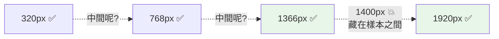

# 機械檢查的設計 - 把「感覺亂」變成可勾清單

> 學習階段：Day 4 ｜ 深度：方法原理
> 目標讀者：全團隊

---

## 📋 概述

「這頁看起來好亂」「這字看不清楚」——這類抱怨聽起來主觀，其實**壞設計有標準訊號**：對比不足有數字、破版有座標、風格雜亂有計數。這一章教機械檢查的設計原理：什麼能客觀化、標準從哪來、在哪一層量測、以及機械方法自己的盲區。

---

## 🧭 核心概念

### 1. 標準的來源：WCAG

無障礙標準 **WCAG 2.1**（W3C）是機械檢查最重要的標準庫，兩條最常用：

| 條款 | 標準 | 量什麼 |
|------|------|--------|
| **1.4.3 對比（最低）** | 一般文字對比 ≥ **4.5:1** | 前景色對背景色的亮度比——「看不清楚」的客觀版 |
| **1.4.10 Reflow** | **400% 縮放**（等效 **320 CSS px** 寬）下內容不得水平捲動 | 放大等於變窄——調大字體、放大頁面時版面撐不撐得住 |

標準的價值不在數字本身，在於**把爭論變成量測**：「我覺得看得清楚」vs「我覺得看不清楚」是僵局，「3.9:1，未達 4.5:1」是工單。

### 2. 在根因所在層量測

同一個品質問題，可以在不同層量測，但**只有根因所在的那一層能給出可修的答案**：

| 檢查 | 量哪一層 | 為什麼 |
|------|---------|--------|
| 顏色對比 | **執行時（runtime）**——真的打開頁面量 | 最終顏色由多層樣式疊加決定，只有 runtime 才知道使用者實際看到什麼 |
| 風格一致性 | **原始碼**——掃描樣式定義 | 雜亂的根因是「定義了太多種字級/字距寫法」；而 runtime 的計算值會**銷毀根因資訊**——相對單位被換算成像素、`bold` 與 `700` 被合併，你看得到結果亂、看不到哪裡寫亂 |

一般化的原則：**量測層錯了，就算數字對，也修不到根因。** 對比的根因在最終呈現 → 去 runtime 量；一致性的根因在定義 → 去原始碼掃。

風格一致性為什麼值得量？感知心理學的 Gestalt 原理一句話版：**人把相似的東西看成同一組**——字級與間距的雜值越多，畫面「自動成組」的能力越差，這就是「說不上來哪裡亂，就是亂」的機制。而風格雜值掃描守的正是 **design system 的收斂**：設計系統用統一的定義（design token）規定每種字級、顏色的唯一值，雜值就是繞過它的證據。

### 3. 決定論矩陣：可重現才可比較

版面檢查的做法是**決定論快照矩陣**：固定的視口清單 × 頁面清單 × 主題清單，每次跑產出同一組截圖。三個設計理由：

1. **可重現**——同一組輸入永遠產出可比對的輸出，改版前後的差異才歸因得到改動本身
2. **覆蓋有據**——視口清單依真實裝置分布挑選（手機／平板兩向／筆電數檔／超寬螢幕），不是隨手拉幾個
3. **機械與判斷分離**——截圖（機械、便宜、可重跑）與判讀（需要視覺判斷）拆成兩步，判讀可以只重看有嫌疑的部分，不必每次重截

判讀時對照的是**明文的驗收條款**（每頁在每種寬度下「什麼叫好」的清單），不是「看起來還行」——這讓不同人、不同次的判讀結果可以比較。

### 4. 抽樣的盲區：離散樣本 vs 連續契約

矩陣有一個結構性盲區：**視口清單是離散樣本，但響應式設計的承諾是連續的**——「從 320px 到 3440px 都要正常」。最糟的破版常常藏在**樣本點之間**（例如剛好比某個折行斷點寬一點的地方，導覽列還在硬撐）。

補盲區的兩個做法：

- **連續掃描**——重要改版時，手動把視窗從最窄拖到最寬掃一遍，加做一輪 **400% 縮放**（WCAG 1.4.10 Reflow 的門檻；200% 快掃是日常的成本折衷，對應的是 1.4.4 Resize Text 的文字放大要求，不能替代 400% 測試）
- **數值量測**——「有沒有超界」不靠目測，問元素的實際寬度是否超過容器（`scrollWidth − clientWidth > 0`）；目測會漏掉一兩個像素的溢出，數字不會

這條原理有兩個譜系：測試學的**邊界值分析**（bug 住在邊界附近，所以要測邊界兩側）；以及更一般的投影盲區論證——任何抽樣都是把連續空間投影到有限樣本上，**投影必有 null space**（掉進去的資訊完全不可見），參見 [general/isomorphism-projection.md](../../general/isomorphism-projection.md)。

### 5. 機械檢查的輸出紀律

- **按根因聚合**——一個壞的顏色設定讓幾百個元素同時不及格＝報告一條（含影響範圍），不是幾百條
- **標注環境**——量測用的是真資料還是替身資料？替身資料量對比沒問題（顏色與資料無關），但量「內容會不會撐破版面」就可能失真——要標注
- **過／不過之外留判斷欄**——標準有例外空間（某些區塊沿用行業慣例可豁免），豁免要明文列出，不是默默跳過

---

## 🔧 我們怎麼做（現行實作參考）

- `responsive-snapshot` skill：決定論截圖矩陣（11 視口 × 3 頁 × 2 主題）＋縮圖總表
- `responsive-review` skill：對明文驗收條款的視覺判讀，含「連續掃描補盲區」步驟
- `ui-audit` skill：WCAG AA 對比量測（runtime）＋風格雜值掃描（原始碼）

皆位於產品 repo（需存取權限）。視口清單、驗收條款、豁免清單都是產品自己的參數；本章的原理（決定論、根因層、抽樣盲區）跨產品通用。

---

## ❓ 常見問題 FAQ

**Q1：機械檢查全過，UI 就沒問題了嗎？**
沒有。機械檢查守的是**客觀下限**（看得清、不破版、風格收斂），「找不找得到入口」「想不想回來」它完全量不到——那是走查家族的守備範圍（[02](./02_evaluation-design.md) 的分工）。

**Q2：對比 4.4:1 差一點點，真的要修嗎？**
標準的價值在於不用每次吵這題。4.5:1 是 WCAG AA 的線，差 0.1 就是沒過；覺得線太嚴，該提的是「本區塊申請豁免並記錄理由」，不是「差不多就好」。

**Q3：為什麼一致性不直接量使用者看到的結果？**
因為計算後的值會銷毀根因資訊：相對單位被換算、同義寫法被合併。你會知道「結果有 14 種字距」，但不知道是原始碼裡哪幾行造成的——修不了。

**Q4：視口矩陣要多細才夠？**
永遠不夠——這正是抽樣盲區的重點。矩陣管例行回歸（便宜、常跑），連續掃描管重要改版（貴、偶跑）。用矩陣的密度換掃描的頻率，是成本配置問題，不是對錯問題。

---

## 🔗 相關文檔

- [04_finding-quality.md](./04_finding-quality.md) — 上一章：發現的品質流水線
- [06_reporting-collaboration.md](./06_reporting-collaboration.md) — 下一章：報告與協作
- [../../general/isomorphism-projection.md](../../general/isomorphism-projection.md) — 投影與 null space：抽樣盲區的數學骨架

---

## 📝 版本歷史

| 版本 | 日期 | 作者 | 變更說明 |
|------|------|------|----------|
| 1.0 | 2026-07-07 | maple | 初版建立 |
| 1.1 | 2026-07-07 | maple | Review 修正：WCAG 1.4.10 Reflow 由誤植的 200% 更正為 400%/320 CSS px（200% 屬 1.4.4）、補 design system 與雜值掃描的銜接 |
