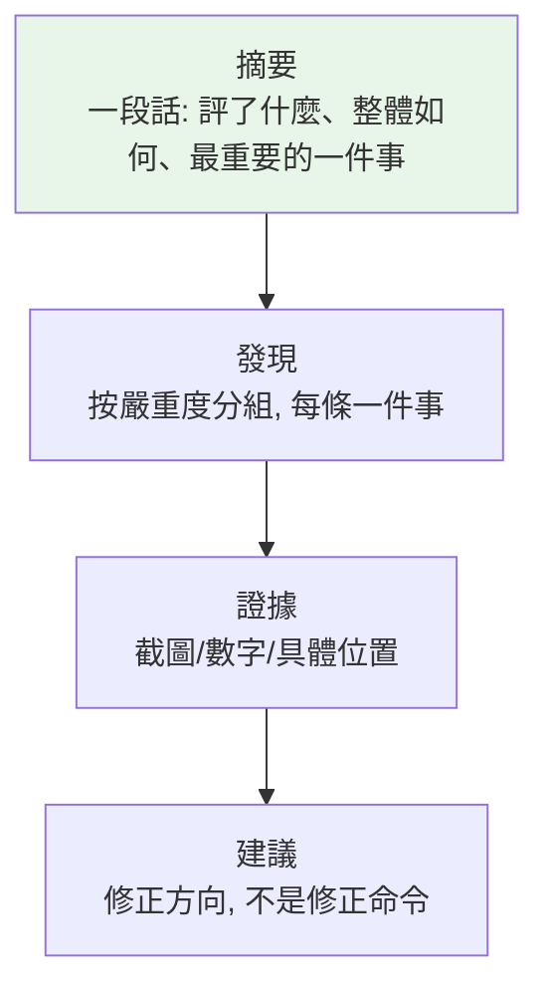
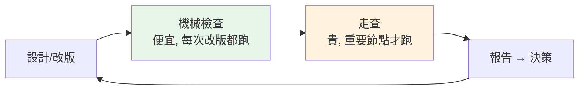

# 報告與協作 - 發現怎麼變成行動

> 學習階段：Day 4 ｜ 深度：交付實務
> 目標讀者：全團隊

---

## 📋 概述

評估做得再好，報告沒人讀懂、沒人行動，等於沒做。這一章教發現的「最後一哩」：報告怎麼組織、語言怎麼轉譯、決策權在誰手上、以及評估發現跟測試 bug 怎麼分工。

---

## 🧭 核心概念

### 1. 報告結構：讓忙的人三十秒抓到重點

三條結構紀律：

- **按嚴重度分組，不按頁面或視口**——讀者要先看最痛的，不是先看第一頁的。同一個缺陷出現在五種寬度＝**一條發現**加受影響清單，不是五條
- **每條發現帶具體證據**——「右側約 1100px 的空白帶」合格；「看起來怪怪的」不合格。具體到別人能找到你看到的東西
- **pass/fail 矩陣收尾**——頁面 × 條件的通過表讓「整體狀況」一眼可見，也讓下次評估有可比對的基準

### 2. 轉譯：讀者是決策者，不是工程師

評估產出充滿內部語彙（原則編號、選擇器、視口代號），但報告的讀者是要做決策的人。兩層轉譯：

| 原始語彙 | 轉譯後 |
|---------|--------|
| 「`.nav-tabs` 在 1280px 視口 wrap 到第二行」 | 「筆電較窄的螢幕上，導覽籤會折行——名稱被切成兩半」 |
| 「對比 3.2:1，未達 WCAG AA 4.5:1」 | 「深色模式下的灰色說明文字看不清楚——比標準暗了約三成」 |

原則：**現象講人話，證據留術語。** 標題與摘要用任何人都懂的描述；技術細節（選擇器、數值）收在證據區給要修的人。這跟 [testing/06](../testing/06_test-result-analysis.md) 報告章的紀律同源。

### 3. 決策權邊界：報告提方向，拍板在使用者

評估報告的建議欄寫的是**修正方向**（「可考慮把這組灰階調亮」），不是修正命令。修不修、怎麼修、何時修，是產品決策——可能有評估看不到的理由（品牌規範、即將改版、成本）。

這條邊界寫死有兩個好處：報告不會因為「建議沒被採納」而失去公信力（它的職責是把狀況照清楚）；決策者也不會被報告綁架（嚴重度 4 是「上線前必修」的**建議**，接受風險上線仍是決策者的權利——但報告確保這是**知情的**決定）。

### 4. 與工程／測試的協作介面

UI/UX 評估發現和測試 bug 是鄰居，分工要清楚：

| | UI/UX 評估發現 | 測試 bug |
|--|---------------|---------|
| 主張 | 「這裡**不好用／不易懂／不美**」 | 「這裡**跟規格不符**」 |
| 判準 | 原則、標準、使用者預期 | 需求規格、預期輸出 |
| 產出 | 排序候選＋修正方向 | bug report（可重現步驟） |
| 走哪裡 | 評估報告 → 設計決策 | bug 追蹤 → 修復驗證 |

實務上的灰色地帶用一個問題劃開：**「有沒有一份規格說它該是別的樣子？」** 有 → 是 bug，照 [testing/05](../testing/05_test-execution-practice.md) 的 Bug Report 格式走（重現步驟、預期 vs 實際、證據）；沒有 → 是評估發現，進評估報告。兩邊互相轉介（評估中發現功能壞掉 → 轉 bug；測試中覺得「能用但很難用」→ 轉評估），轉介時附上證據，不重複調查。

### 5. 協作節奏：評估嵌在哪裡

- **機械檢查**便宜且決定論 → 嵌進每次可見改版的例行程序（合併前跑一輪矩陣＋標準量測）
- **走查**貴且消耗「天真」評估者 → 留給重要節點（大改版前後、新功能上線前），別揮霍
- 報告的發現回流到下一輪設計，形成循環——評估不是驗收關卡，是設計流程的一部分（Double Diamond 的 Deliver 端，見 [01](./01_uiux-fundamentals.md)）

---

## ❓ 常見問題 FAQ

**Q1：報告要多長？**
以「摘要一段＋每條發現三五行＋矩陣一張」為基準。長度不是品質——一份五條高信心發現的報告，勝過五十條未驗證雜訊。

**Q2：發現被否決（不修），要爭嗎？**
報告的職責在「知情」達成時就完成了。可以確認決策者理解了嚴重度與後果，理解後的取捨尊重之——把否決理由記下來，下次評估時它是背景知識。

**Q3：評估發現要進 bug 追蹤系統嗎？**
判定是 bug 的轉過去（附證據），其餘留在評估報告。把「不好用」塞進 bug 系統的結果通常是被標 wontfix 沉底——它需要的是設計討論，不是修復流程。

**Q4：多久做一次完整評估？**
機械檢查跟著改版走（每次）；走查跟著風險走（大改版、新功能）。「定期全面體檢」聽起來安心，實際上容易變成沒人讀的例行公事——評估要嵌在決策點上，不是日曆上。

---

## 🔗 相關文檔

- [05_mechanical-checks.md](./05_mechanical-checks.md) — 上一章：機械檢查的設計
- [00_outline.md](./00_outline.md) — UI/UX 角色學習大綱
- [../testing/05_test-execution-practice.md](../testing/05_test-execution-practice.md) — Bug Report 規範（協作介面的另一端）
- [../testing/06_test-result-analysis.md](../testing/06_test-result-analysis.md) — 測試報告撰寫（同源紀律）

---

## 📝 版本歷史

| 版本 | 日期 | 作者 | 變更說明 |
|------|------|------|----------|
| 1.0 | 2026-07-07 | maple | 初版建立 |
| 1.1 | 2026-07-07 | maple | Review 修正：轉譯範例去產品化、「Bug Report 三要素」改為與 testing/05 一致的表述 |
