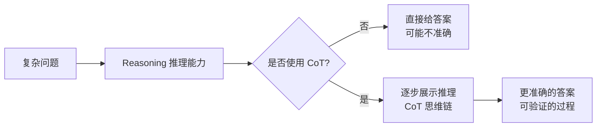

## CoT vs Reasoning

### 关键区别

| 概念 | 本质 | 作用 |
|------|------|------|
| **Reasoning** | 能力/过程 | 从信息推导结论 |
| **CoT** | 方法/技术 | 展示推理的步骤 |

**类比**：
- **Reasoning** = 思考能力（大脑的功能）
- **CoT** = 列式计算（帮助思考的方法）

---

## 它们的关系

**核心观点**：
- **Reasoning** 是 AI 本身具备的推理能力
- **CoT** 是让 Reasoning 更清晰、更可靠的技术
- **使用 CoT** → 提升 Reasoning 的质量

