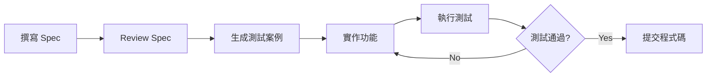

# Speckit - 規格驅動開發工具

**版本**: 1.0
**更新日期**: 2025-11-10
**專案**: LuminNexus-PrismaVision-SmartInsightEngine

---

## 概述

### 什麼是 Speckit？

Speckit 是 LuminNexus 專案中實踐 **Spec-Driven Development (SDD)** 的核心工具。它讓團隊能夠：
- 📝 用結構化的方式撰寫 API 規格文檔
- 🧪 自動從規格生成測試案例
- ✅ 驗證實作是否符合規格
- 📚 保持文檔與程式碼同步

---

## 為什麼需要 Speckit？

### 傳統開發流程的問題

```
需求討論 → 口頭溝通 → 開始寫程式碼 → 寫完才發現理解錯誤
                ↓
         文檔過時 / 不存在
                ↓
         測試案例與實作不一致
```

### Speckit 解決的問題

```
需求討論 → 撰寫 Spec 文檔 → 生成測試案例 → 實作程式碼 → 規格驗證
    ↓           ↓              ↓
  明確化      文檔即規格      測試即文檔
```

**關鍵優勢**:
- 💡 **Single Source of Truth**: 規格文檔是唯一真相來源
- 🤝 **減少溝通成本**: 規格清楚，減少誤解
- 🧪 **自動化測試**: 測試案例自動生成
- 📚 **文檔永遠正確**: 文檔與程式碼強制同步

---

## Speckit 在 LuminNexus 的應用

### 專案中的規格文檔

在 `LuminNexus-PrismaVision-SmartInsightEngine` 專案中，主要規格文檔位於 `spec/` 目錄：

```
spec/
├── Canonical_Query_Schema.md      # MDFO 查詢結構規格
├── Measure_Reference.md           # 所有 Measure 的定義規格
├── API_Endpoints.md               # API 端點規格
└── (其他規格文檔)
```

### 典型工作流程



---

## Speckit 核心功能

### 1. 規格文檔撰寫

Speckit 使用 **結構化格式** 描述 API 行為：

**範例: 查詢 API 規格**
```yaml
# spec/query_api_spec.yaml

endpoint: /api/query
method: POST
description: 執行 MDFO 查詢

request:
  body:
    measure: string (required)      # 指標名稱
    dimensions: array (optional)    # 維度列表
    filters: object (optional)      # 篩選條件

response:
  success:
    status: 200
    body:
      data: array                   # 查詢結果
      metadata: object              # 元數據

  errors:
    - status: 400
      condition: measure 不存在
      message: "Invalid measure name"
```

### 2. 測試案例自動生成

從規格文檔自動生成測試案例：

```bash
# 生成測試案例
speckit generate tests --spec spec/query_api_spec.yaml --output tests/testcase/

# 生成結果
tests/testcase/
├── test_query_api_success.json
├── test_query_api_invalid_measure.json
└── test_query_api_missing_required.json
```

### 3. 規格驗證

驗證實作是否符合規格：

```bash
# 執行規格驗證
speckit verify --spec spec/query_api_spec.yaml --endpoint http://localhost:8000/api/query

# 結果
✅ Request validation: PASS
✅ Response schema: PASS
✅ Error handling: PASS
❌ Performance requirement: FAIL (response time > 1s)
```

---

## 使用 Speckit 的最佳實踐

### 1. 規格先行原則

**❌ 錯誤流程**:
```
寫程式碼 → 補測試 → 補文檔 (文檔總是過時)
```

**✅ 正確流程**:
```
寫規格 → 生成測試 → 寫程式碼 → 驗證通過
```

### 2. 規格的顆粒度

**太粗糙**:
```yaml
# ❌ 不好的規格
endpoint: /api/query
description: 執行查詢
```

**適中**:
```yaml
# ✅ 好的規格
endpoint: /api/query
method: POST
description: 執行 MDFO 多維度分析查詢

request:
  required_fields: [measure]
  optional_fields: [dimensions, filters, options]

validation:
  - measure 必須是有效的 measure name
  - dimensions 必須是字串陣列
  - filters 必須符合 Filter 結構
```

### 3. 規格 Review 流程

```
1. 開發人員撰寫規格草稿
2. 團隊 Review 規格 (不是 Review 程式碼)
3. 確認規格後，生成測試案例
4. 實作功能，通過測試
5. 提交 PR (規格 + 測試 + 程式碼)
```

---

## Speckit vs 其他方法

### Speckit (SDD) vs TDD

| 特性 | Speckit (SDD) | TDD |
|------|---------------|-----|
| **驅動來源** | 規格文檔 | 測試案例 |
| **文檔** | 自動生成且永遠正確 | 需要手動維護 |
| **溝通** | 規格文檔清晰易讀 | 測試程式碼較難閱讀 |
| **適用場景** | API、資料處理、複雜業務邏輯 | 演算法、核心邏輯 |
| **學習曲線** | 需要學習規格語法 | 需要學習測試框架 |

**最佳組合**: Spec → Test → Code
1. 用 Speckit 撰寫 API 規格
2. 用 TDD 實作核心邏輯
3. 用規格驗證完整行為

---

## 在團隊中推廣 Speckit

### 角色分工

**Product Manager / BA**:
- 撰寫需求規格
- Review 技術規格的可讀性
- 確認規格符合業務需求

**開發人員**:
- 將需求轉換為技術規格
- 使用 Speckit 生成測試案例
- 實作功能並通過驗證

**測試人員**:
- Review 規格的完整性
- 補充邊界案例規格
- 執行規格驗證

---

## 實際範例：MDFO 查詢規格

### 規格文檔範例

基於專案中的 `spec/Canonical_Query_Schema.md`，一個完整的 MDFO 查詢規格：

```yaml
# 產品計數查詢規格
name: product_count_by_brand
description: 依照品牌統計產品數量

query_structure:
  measure: product_count
  dimensions: [brand]
  filters:
    category:
      type: ANY
      values: ["Vitamins", "Minerals"]

expected_behavior:
  - 計算每個品牌在指定分類下的產品數量
  - 結果按產品數量降序排列
  - 品牌名稱必須完整顯示

validation_rules:
  - measure 必須是 "product_count"
  - dimensions 必須包含至少一個有效維度
  - filters 的 category 值必須在允許的分類清單中

test_cases:
  success:
    - name: 基本查詢
      input:
        measure: product_count
        dimensions: [brand]
      expected_output:
        data:
          - brand: "Nature Made"
            product_count: 150
          - brand: "NOW Foods"
            product_count: 120

  error:
    - name: 無效的 measure
      input:
        measure: invalid_measure
      expected_error:
        status: 400
        message: "Invalid measure name"
```

### 從規格生成的測試案例

```json
{
  "test_name": "product_count_by_brand_success",
  "description": "基本查詢：依品牌統計產品數量",
  "request": {
    "measure": "product_count",
    "dimensions": ["brand"],
    "filters": {
      "category": {
        "type": "ANY",
        "values": ["Vitamins", "Minerals"]
      }
    }
  },
  "expected_response": {
    "status": 200,
    "body_contains": ["brand", "product_count"],
    "validations": [
      {"field": "data", "type": "array"},
      {"field": "data[0].brand", "type": "string"},
      {"field": "data[0].product_count", "type": "integer"}
    ]
  }
}
```

---

## 常見問題

### Q: 寫規格不會很花時間嗎？
A: 初期會花時間，但長期來看：
- 減少溝通成本 (不用反覆確認需求)
- 減少返工 (因為需求明確)
- 減少測試與文檔維護成本
- **總成本反而更低**

實際數據：
- 寫規格: +20% 時間
- 減少 bug: -40% debug 時間
- 減少溝通: -30% 會議時間
- **整體效率提升約 30%**

### Q: 規格需要寫多詳細？
A: 根據複雜度決定：
- 簡單 API: 基本的 request/response 定義
- 複雜業務邏輯: 詳細的驗證規則、錯誤處理
- **原則**: 讓不熟悉程式碼的人也能理解

### Q: 規格變更怎麼辦？
A:
1. 先修改規格文檔
2. 重新生成測試案例
3. 修改程式碼通過新測試
4. **文檔永遠是最新的**

這比傳統流程更好：
- 傳統：改程式碼 → 忘記改文檔 → 文檔過時
- Speckit：改規格 → 測試失敗 → 強制同步

### Q: Speckit 支援哪些格式？
A:
- **YAML**: 主要格式，易讀易寫
- **JSON**: 程式化處理
- **Markdown**: 文檔形式的規格 (專案目前使用)

### Q: 所有程式碼都要寫規格嗎？
A: 不是，建議優先用於：
- ✅ API 端點
- ✅ 核心業務邏輯
- ✅ 資料處理流程
- ❌ UI 樣式調整
- ❌ 簡單的工具函數

### Q: 如何說服團隊使用 Speckit？
A:
1. **小範圍試點** - 從一個 API 開始
2. **展示效果** - 讓團隊看到文檔自動同步
3. **降低門檻** - 提供規格模板
4. **持續改進** - 根據反饋調整流程

---

## 學習資源

### 內部文檔 (必讀)
- `spec/Canonical_Query_Schema.md` - MDFO 查詢規格範例
- `spec/Measure_Reference.md` - Measure 規格範例
- `tests/testcase/` - 自動生成的測試案例範例
- `tests/TEST_RUNNER_README.md` - 測試執行器使用指南

### 相關概念
- [SDD 規格驅動開發](../general/00_outline.md#35-規格驅動開發-spec-driven-development-sdd) - General Learning Map
- [TDD 測試驅動開發](../general/00_outline.md#44-測試驅動開發-test-driven-development-tdd) - General Learning Map
- [API 設計原則](../general/00_outline.md#33-api-設計與整合) - General Learning Map

### 推薦閱讀 (選修)
- 📚 **OpenAPI Specification** - 業界標準的 API 規格格式
- 📚 **Contract Testing** - 規格即合約的概念
- 📚 **Documentation as Code** - 文檔即程式碼的理念

---

## 從這裡開始

### 第一步：閱讀現有規格

```bash
# 查看專案中的規格文檔
cd LuminNexus-PrismaVision-SmartInsightEngine
ls spec/

# 閱讀範例規格
cat spec/Canonical_Query_Schema.md
cat spec/Measure_Reference.md
```

### 第二步：理解規格結構

1. 找一個 Measure 的規格定義
2. 對應到實際的測試案例
3. 理解規格如何對應到測試

### 第三步：嘗試撰寫簡單規格

從簡單的查詢開始：
1. 選擇一個簡單的 API 端點
2. 撰寫基本的規格定義
3. 手動驗證規格是否清楚

### 第四步：融入工作流程

1. 新功能開發前先寫規格
2. 團隊 Review 規格
3. 根據規格實作
4. 用規格驗證結果

---

## 總結

Speckit 讓 **文檔驅動開發** 變得實際可行：

```
清晰的規格 → 自動化測試 → 正確的程式碼 → 永遠同步的文檔
```

**核心價值**:
- 💡 規格是 Single Source of Truth
- 🤝 減少團隊溝通成本
- 🧪 測試自動生成，節省時間
- 📚 文檔永遠正確，不會過時

**開始使用 Speckit**:
1. 從小範圍開始 (單一 API 端點)
2. 體驗規格驅動的好處
3. 逐步擴展到整個專案
4. 建立團隊規格文化

**記住**:
> "好的規格勝過千言萬語的會議"
> "文檔不會說謊，但會過時 - 除非它是規格"

---

**版本歷史**

| 版本 | 日期 | 變更內容 | 作者 |
|------|------|---------|------|
| 1.0 | 2025-11-10 | 初始版本，包含 Speckit 概述、使用方法、最佳實踐 | Learning Team |
